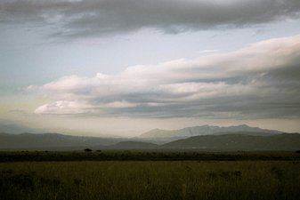
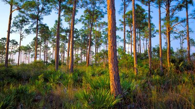
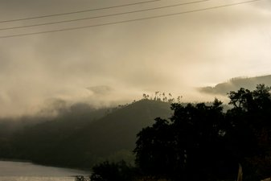
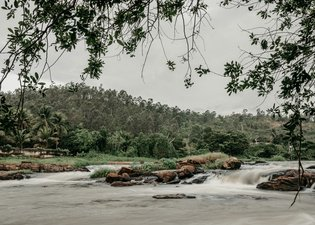
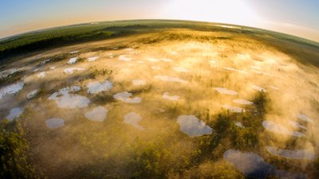
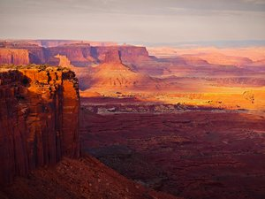
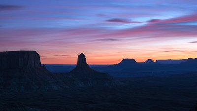
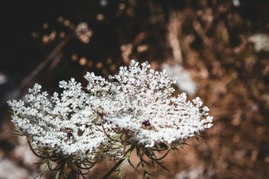
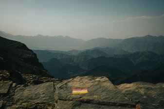

# 📅 DailyWallpaperHub

> 多源壁纸聚合平台 · 自动归档 Bing + Unsplash 精选壁纸 · AI 视觉故事生成 · 企业微信推送 · GitHub Pages 在线画廊

[English](README_EN.md) | [中文](README.md)

[](https://github.com/Hana19951208/DailyWallpaperHub/actions/workflows/daily.yml)
[](https://Hana19951208.github.io/DailyWallpaperHub/)

---

## ✨ 项目特性

- **🎨 多源聚合**: 支持 Bing、Unsplash 等多个壁纸源，配置化管理，易于扩展新数据源
- **⚡️ 异步架构**: AI 故事生成异步处理，主流程快速完成，图片立即可用
- **🤖 AI 视觉故事**: 集成 LLM 视觉大模型，自动为每张壁纸生成精美的地理文化背景故事（约 500 字）
- **📝 提示词外部化**: AI 提示词存储在 `prompts/story_prompt.txt`，可随时自定义优化
- **⏰ 智能调度**: GitHub Actions 每小时自动检测更新，第一时间获取最新壁纸
- **💾 持久化归档**: 高清原图、缩略图、元数据 (JSON) 及 AI 故事自动提交至仓库，永不丢失
- **📂 GitHub 镜像图床**: 支持自动同步至另一个 GitHub 仓库（如 `blog-images`），作为备份与 CDN 加速使用
- **🎭 现代化展示**: 内置 GitHub Pages 在线画廊，支持响应式布局与暗黑模式
- **📱 企业微信推送**: 自动推送多源图片、元数据和 AI 故事到企业微信群（支持动态数据源标识）
- **🎯 数量限制**: 索引默认只展示最近 10 天，避免页面过长（可在 `config/sources.yaml` 中调整）
- **🛠 批量工具**: 支持按日期和源批量抓取历史壁纸
- **💰 零成本**: 完全基于 GitHub 免费资源构建

---

## 🖼 效果展示

### 在线画廊


### AI 故事 (点击标题阅读)
点击壁纸索引中的标题，即可跳转阅读由 AI 生成的背景故事（包含原图展示）。

---

## 📅 壁纸索引 (最新)

<!-- WALLPAPER_INDEX_START -->
<table width="100%">
<tr><th width="15%">日期</th><th width="42%">Bing 🔍</th><th width="42%">Unsplash 📷</th></tr>
<tr>
<td align="center"><b>2026-04-26</b></td>
<td align="center" valign="top"><small>-</small></td>
<td align="center" valign="top"><a href="docs/wallpapers/unsplash/2026-04/2026-04-26/image.jpg"></a><br /><small>brown wheat in close up photography</small></td>
</tr>
<tr>
<td align="center"><b>2026-04-25</b></td>
<td align="center" valign="top"><a href="docs/wallpapers/bing/2026-04/2026-04-25/image.jpg"></a><br /><small>繁花盛放</small></td>
<td align="center" valign="top"><a href="docs/wallpapers/unsplash/2026-04/2026-04-25/image.jpg"></a><br /><small>a house in the middle of a field with a mountain in the background</small></td>
</tr>
<tr>
<td align="center"><b>2026-04-24</b></td>
<td align="center" valign="top"><a href="docs/wallpapers/bing/2026-04/2026-04-24/image.jpg"></a><br /><small>打破企鹅规则</small></td>
<td align="center" valign="top"><a href="docs/wallpapers/unsplash/2026-04/2026-04-24/image.jpg"></a><br /><small>a grassy field with mountains in the distance</small></td>
</tr>
<tr>
<td align="center"><b>2026-04-23</b></td>
<td align="center" valign="top"><a href="docs/wallpapers/bing/2026-04/2026-04-23/image.jpg"></a><br /><small>向树木致敬</small></td>
<td align="center" valign="top"><a href="docs/wallpapers/unsplash/2026-04/2026-04-23/image.jpg"></a><br /><small>a view of a mountain with a body of water in the foreground</small></td>
</tr>
<tr>
<td align="center"><b>2026-04-22</b></td>
<td align="center" valign="top"><a href="docs/wallpapers/bing/2026-04/2026-04-22/image.jpg"></a><br /><small>一座充满故事的小屋</small></td>
<td align="center" valign="top"><a href="docs/wallpapers/unsplash/2026-04/2026-04-22/image.jpg"></a><br /><small>green trees near river during daytime</small></td>
</tr>
<tr>
<td align="center"><b>2026-04-21</b></td>
<td align="center" valign="top"><a href="docs/wallpapers/bing/2026-04/2026-04-21/image.jpg"></a><br /><small>行动的力量</small></td>
<td align="center" valign="top"><a href="docs/wallpapers/unsplash/2026-04/2026-04-21/image.jpg"></a><br /><small>lake in the middle of mountains during daytime</small></td>
</tr>
<tr>
<td align="center"><b>2026-04-20</b></td>
<td align="center" valign="top"><a href="docs/wallpapers/bing/2026-04/2026-04-20/image.jpg"></a><br /><small>春季的“带刺巡逻兵”</small></td>
<td align="center" valign="top"><a href="docs/wallpapers/unsplash/2026-04/2026-04-20/image.jpg"></a><br /><small>A scenic view of the grand canyon in the desert</small></td>
</tr>
<tr>
<td align="center"><b>2026-04-19</b></td>
<td align="center" valign="top"><a href="docs/wallpapers/bing/2026-04/2026-04-19/image.jpg"></a><br /><small>日落之后，探索仍在继续</small></td>
<td align="center" valign="top"><a href="docs/wallpapers/unsplash/2026-04/2026-04-19/image.jpg"></a><br /><small>white flowers in tilt shift lens</small></td>
</tr>
<tr>
<td align="center"><b>2026-04-18</b></td>
<td align="center" valign="top"><a href="docs/wallpapers/bing/2026-04/2026-04-18/image.jpg"></a><br /><small>潮汐留下的印记</small></td>
<td align="center" valign="top"><a href="docs/wallpapers/unsplash/2026-04/2026-04-18/image.jpg"></a><br /><small>green grass field and mountain under white clouds and blue sky during daytime</small></td>
</tr>
<tr>
<td align="center"><b>2026-04-17</b></td>
<td align="center" valign="top"><a href="docs/wallpapers/bing/2026-04/2026-04-17/image.jpg"></a><br /><small>未完成巨像的静默</small></td>
<td align="center" valign="top"><a href="docs/wallpapers/unsplash/2026-04/2026-04-17/image.jpg"></a><br /><small>Oman , 
From the Horizon of Jabal Hatt  </small></td>
</tr>
</table>
<!-- WALLPAPER_INDEX_END -->

---

## 🚀 快速开始

### 本地开发

```bash
# 1. 克隆仓库
git clone https://github.com/Hana19951208/DailyWallpaperHub.git
cd DailyWallpaperHub

# 2. 安装依赖（使用 conda 环境）
conda activate base
pip install -r requirements.txt

# 3. 配置环境变量
cp .env.example .env
# 编辑 .env 文件，填入以下配置：
# WEWORK_WEBHOOK=your_webhook_url
# LLM_API_KEY=your_api_key
# LLM_BASE_URL=https://api.openai.com/v1
# LLM_MODEL_NAME=gpt-4o
# UNSPLASH_ACCESS_KEY=your_unsplash_key

# 4. 快速抓取壁纸（跳过故事生成）
python fetch_bing_wallpaper.py --skip-story
python fetch_unsplash_wallpaper.py --skip-story

# 5. 异步生成故事（后台运行）
python scripts/generate_missing_stories.py

# 6. 批量抓取历史壁纸
python batch_fetch.py bing 2025-12        # 抓取 Bing 整月
python batch_fetch.py unsplash 2025-12-10 # 抓取 Unsplash 指定日期
```

### GitHub Actions 部署

1. **Fork 本仓库**

2. **配置 GitHub Secrets**（Settings → Secrets and variables → Actions）:
   - `WEWORK_WEBHOOK`: 企业微信群机器人 Webhook URL
   - `LLM_API_KEY`: LLM API 密钥
   - `LLM_BASE_URL`: LLM API 基础 URL
   - `LLM_MODEL_NAME`: LLM 模型名称
   - `UNSPLASH_ACCESS_KEY`: Unsplash API 访问密钥
    - `IMAGE_REPO`: 镜像图床仓库路径（如 `Hana19951208/blog-images`）
    - `GITHUB_TOKEN`: GitHub Token (默认已提供，无需手动设置)

3. **启用 GitHub Pages**:
   - Settings → Pages
   - Source: Deploy from a branch
   - Branch: `main` / `docs`

4. **手动触发或等待定时任务**:
   - Actions → Daily Wallpaper Fetch → Run workflow

---

## 📁 项目结构

```
DailyWallpaperHub/
├── config/
│   └── sources.yaml          # 数据源配置
├── prompts/
│   └── story_prompt.txt      # AI 提示词模板
├── scripts/
│   ├── fill_unsplash_dec.py  # Unsplash 数据补充脚本
│   └── generate_missing_stories.py  # 异步故事生成脚本
├── src/
│   ├── config_loader.py      # 配置加载器
│   ├── utils.py              # 企业微信推送工具
│   ├── update_readme.py      # README 更新器
│   └── update_gallery.py     # Gallery 更新器
├── docs/
│   ├── index.html            # GitHub Pages 画廊
│   └── wallpapers/           # 404 修复：由于部署源在 docs/，壁纸必须放在此目录下
│       ├── bing/
│       │   └── YYYY-MM-DD/
│       │       ├── image.jpg
│       │       ├── thumb.jpg
│       │       ├── meta.json
│       │       └── story.md
│       └── unsplash/
│           └── YYYY-MM-DD/
│               ├── image.jpg
│               ├── thumb.jpg
│               ├── meta.json
│               └── story.md
├── .github/workflows/
│   └── daily.yml             # 自动化工作流
├── fetch_bing_wallpaper.py   # Bing 抓取器
├── fetch_unsplash_wallpaper.py # Unsplash 抓取器
├── batch_fetch.py            # 批量抓取工具
├── requirements.txt          # Python 依赖
└── README.md                 # 项目文档
```

---

## 🎯 使用说明

### 异步故事生成

为了提升用户体验，本项目采用异步架构：

1. **快速模式**（默认推荐）:
   ```bash
   python fetch_bing_wallpaper.py --skip-story
   ```
   - 只下载图片和元数据
   - 立即更新 README 和 Gallery
   - 图片可立即查看

2. **后台生成故事**:
   ```bash
   python scripts/generate_missing_stories.py
   ```
   - 扫描所有缺失故事的壁纸
   - 批量调用 LLM 生成故事
   - 自动更新元数据和页面

### 批量抓取

```bash
# 抓取 Bing 壁纸
python batch_fetch.py bing 2025-12        # 整月
python batch_fetch.py bing 2025-12-10     # 指定日期

# 抓取 Unsplash 壁纸
python batch_fetch.py unsplash 2025-12    # 整月（多张当前精选）
python batch_fetch.py unsplash 2025-12-10 # 指定日期

# 源参数忽略大小写
python batch_fetch.py BING 2025-12
python batch_fetch.py Unsplash 2025-12-10
```

### 添加新数据源

1. 编辑 `config/sources.yaml`:
   ```yaml
   sources:
     - name: new_source
       display_name: "新数据源 🎨"
       enabled: true
       api_key_env: "NEW_SOURCE_API_KEY"
       fetcher_script: "fetch_new_source.py"
   ```

2. 创建 `fetch_new_source.py` 抓取脚本

3. 运行测试并提交

---

## 🤝 关注我


> 扫码关注「把知识变成系统」

## ⚖️ 开源协议

本项目基于 MIT 协议开源。仅供学习交流，壁纸版权归微软必应和 Unsplash 所有。
