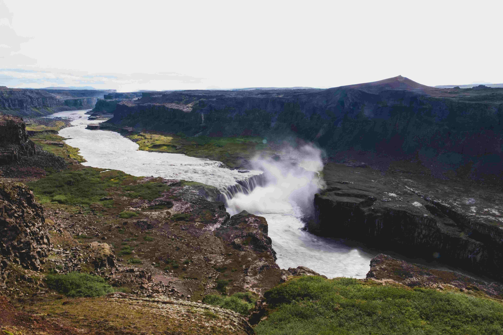

# A River Running Through a Valley Surrounded by Mountains  

在这幅画中，一条河流如银练般斜穿深邃山谷，四周被巍峨山脉紧紧环拥。光影在天地间轻柔舞蹈，山体的暗域与河流明域交织出层次分明的画面。暗灰与黑色的岩石上，斑驳的光斑似时光镌刻的印迹，河流流速处泛着银白波光，缓处若镜面般平滑。瀑布处白浪奔涌，水雾化作朦胧白纱，给苍茫的山谷添了仙气。翠绿的斑点在岩石缝隙与谷底生根，如灵动的温柔注脚，与山体粗犷的质感形成和谐对照。  

河流蜿蜒如生命的脉络，山脉如沉默的守护者，瀑布处白浪与水雾为冷峻峡谷注入热烈湿度。这片景致背后，是地质与岁月雕琢的轨迹——火山熔岩与冰川共同塑造这般雄浑地貌。在当地文化里，这条河是活着的史诗，渔人、舟子的故事沿水岸流传，先人依水而居，河流哺育文明，成为人与自然共生共荣的见证。此地山水，承载历史的苍劲，又蕴含生命的热烈，每道光影、每抹色彩、每个空间，皆成自然与人文对话的注脚，引人沉醉于大地赠予的壮美与深情。