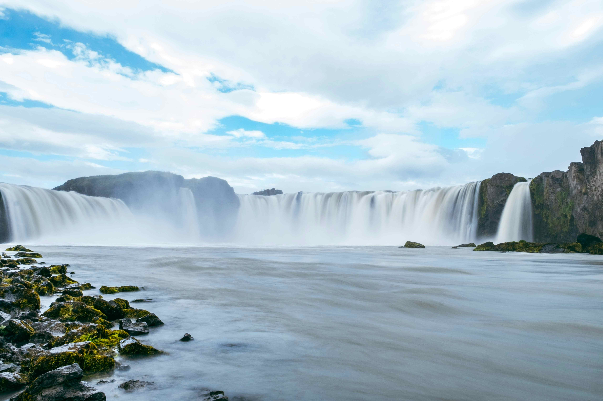

# 冰川之舞与自然史诗

阳光轻吻瀑布，将水流切割成银白的光带，在雾气中晕开层层的朦胧幻光。这张瀑布的壮丽画面里，水分如时间的脉络悄然铺展——从山岩边缘奔腾倾泻，至跌落时化作白绢般的流动，每一道水流都承载着冰川消融的厚重与浪漫。天空澄澈如洗，云朵如棉纱轻掩其上，为瀑布镶定柔缓的边界，远山与近水的色调交织，构成自然初始的诗性奏鸣。  

岩石的暗哑色调与苔藓的葱郁绿意形成强烈对比，水雾在光影中浮动，为整个场景罩上水墨晕染般的温柔意境。水流倾泻的刹那，光影在岩壁与水面流转，演出震撼又静谧的视觉交响。  

这片瀑布背后，是冰岛标志性地热与冰川交融的地理奇观——冰川融化的水与火山地热共同铸就了如此磅礴景象。在此，水不只是自然景观，更是冰岛文化灵魂的延伸。古时当地人视瀑布为自然神性的具象，水流被看作是生命与能量流转的信仰载体，每道飞溅的水花都在诉说经年累月的地质变迁与人文敬畏。当摄影师以镜头定格这一壮阔画面，也接住了冰岛的灵魂：山与水的对话，时光与自然的同歌，让这场大瀑布坠落，不止是景观的震撼，更是地理与文化的史诗注脚。