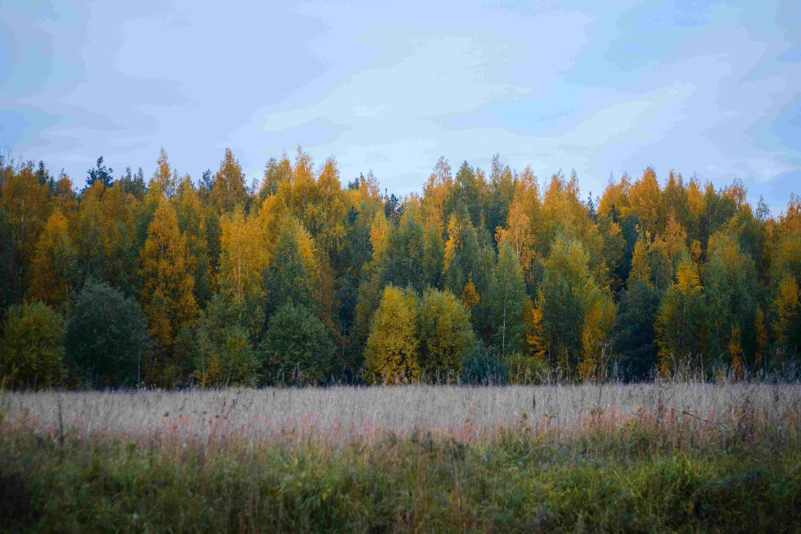

# a field with tall grass and trees in the background  
柔和的光线如轻纱般轻覆在开阔的草地上，高草在微风间漾起波浪，灰褐与嫩绿的色调交织，仿若大地正褪去活泼的盛夏，换上秋意的素雅。背景里的树林如绿色的诗行，金黄与深绿的枝叶错落，在淡蓝色的天空下编织出温柔的层次。光线从天际悄然而降，给草浪笼上柔光轮廓，给林梢镀上暖金边，整个场景裹着朦胧的诗意，仿佛时间在此狠狠慢下脚步。  

色彩是这片原野的魂魄：金黄的树叶在风里轻颤，如先民的图腾闪着温度，深绿色的树干是土地的筋骨，而天空的淡蓝是自然的呼吸之息。构图如一首静谧的散文，前景草地的空灵与中景树林的厚重形成呼应，又因远处天际线的温柔连接，构建出回归自然的层次美感，让观者仿若插入时光缝隙，触碰到大地与天穹的呼吸韵律。  

这片地域处于森林与草原的过渡地带，地理与文化脉络在此清晰舒展。春夏秋冬的更替与植被季相变化，是当地族群与土地千年共生的注脚。春草萌发时，是狩猎、迁徙的神圣时节；秋林染金时，是祭祀、收获的仪式时刻，树叶的色彩承载着对自然的敬畏与感恩。这里的草与林，不止是风景，更是文化与生命的载体——每一缕风卷过草浪，每一次树叶泛起金光，都是自然与人文共振的合唱，诉说着一方水土与一群人的灵魂契约，见证着人与土地长久以来相互成就的厚重的爱意与智慧。