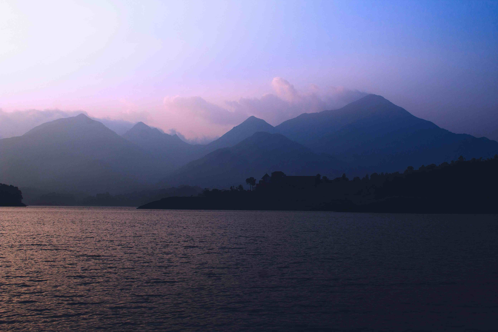

# 夕阳与云雾吻过的湖岸故事

当夜幕在Banasura Sagar湖的褶皱纹理间悄然铺展，整个天地似被酿成了一曲静谧的乐章。画面里，天际被温柔的粉紫与靛蓝晕染，仿佛有人轻卷云的褶皱，让霞光从山腰间缓缓垂落。远山如黛，在轻悠悠的薄雾中漾开层层轮廓，每一道山脊都成了时光凝滞的注脚，而湖面恰似一方温柔的大理石，将梦幻的暮色收进柔和的波纹——水纹随呼吸轻颤，映着天空的紫、山的青，恍若一场视觉上的诗意梦境。  

构图如自然写意的掌纹，近景是涟漪细语，中景是山脉沉默的剪影，远景是云雾低垂的温柔絮语。光影是这场画卷的脉络，夕阳将余温泼向水色，让湖面泛起暖金色微光，又随暮色悄然加深，成了靛蓝幕布下温柔的一笔。此处并非单纯风景，而是地理与人文共舞的场域：Banasura Sagar湖是自然慷慨的馈赠，也承载了当地人文对山水灵气的敬畏与生活记忆。傍晚时分，沿湖漫步的人们或许会让自己身影融入山的影、水的迹，在天地一色的宁静里，重新架构对自然与岁月的理解。  

这处山水间的秘境，本就是自然与人文相拥一生的注脚。当云雾为山覆上柔纱，当暮色为湖镶上柔光，当建筑的黑影静静伫立在山与水的臂弯间，我们看到的，何止是美景？那是千万个傍晚里，人类对天地时节的懂得，是山水以千万年时光编织的古老故事，正于此时，在光影与波纹间静静流淌。