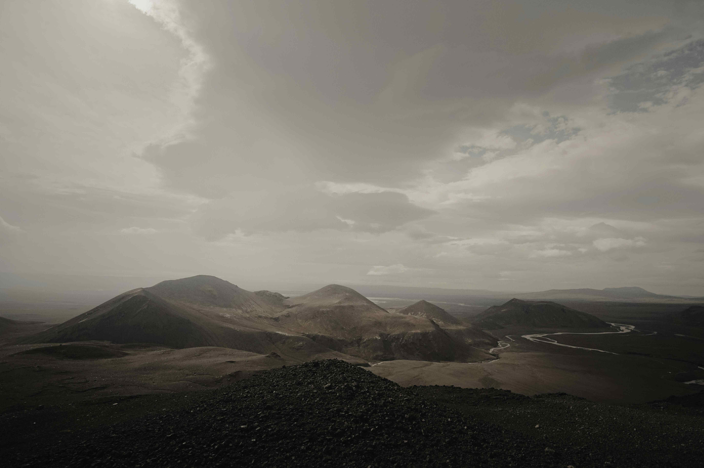

# Brown Mountains Under White Clouds During Daytime

于白昼的温柔脉络里，棕褐的山脉肃穆地绵延开去，山体似岁月沉淀的大地墨色，每一道褶皱与峰峦都是地壳史诗的注脚。白云如棉絮般舒展在天际，或浓密或轻盈，将光影切割成错落的明暗诗章。天空晕着浅灰与素白的交织，云层半遮半掩，给山脉蒙上一层朦胧的诗意滤镜；远处的溪流如银线蜿蜒，为死寂的棕褐大地注入灵动的生机，山海之境在此刻达成温柔的平衡。山峦连绵起伏，各自以独特的弧度舒展，光影随云动而变，山体色彩在明暗间洇开层次丰富的纹理。

这处景观，常生长于地热活跃、火山频发的区域，棕褐的山体是千万年地质力量的留痕——火山灰的沉淀与风化的雕琢，让山岩染上了厚重沧桑的底色；而天空的白云，是自然赋予的灵动注脚。当地人们以敬畏与亲近的姿态与山水共生，棕褐山脉成为文化与自然对话的载体，见证了人类对原始力量的谦卑赞叹。远望时，棕褐与白韵交织成天地间的抒情乐章；近观处，山石纹理与云影流动，皆在诉说地球脉搏与人类精神的共舞传奇。当阳光轻触峰峦，山体光影斑驳，云层呼吸间，自然的史诗与人文记忆在此刻共鸣延伸，成为时光里沉默却深邃的诗行。