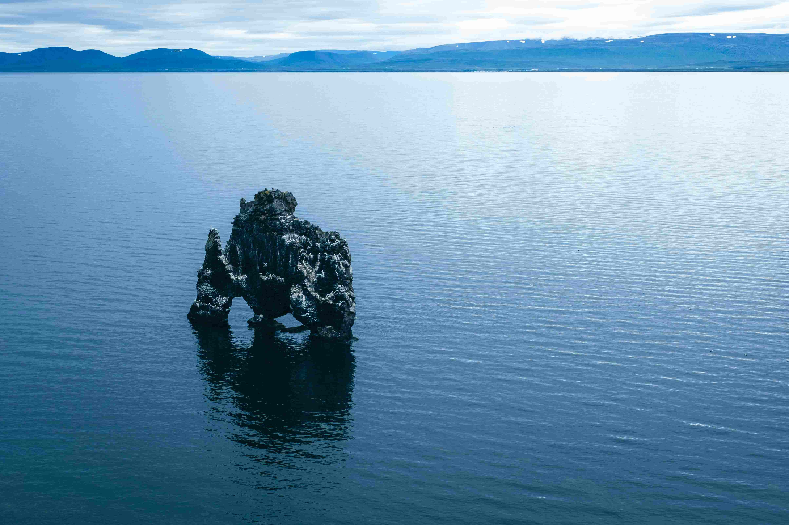

# a rock in the middle of a body of water  
当目光投向水中央的那块岩石时，时间仿佛都悄然放缓了脚步。广袤的水域如深蓝宝石般，以澄澈而深邃的色调铺展，温柔地托举着独立伫立的岩石。阳光在此处碎成细碎的光斑，洒落在岩石之上，深灰与浅褐的纹理在光晕里变得凝重且生动，每一道沟壑都像是岁月镌刻的纹路，风与水的雕琢在此凝聚成为永恒的故事。  

从视觉构图来看，岩石居于画面中央，成为视觉焦点，四周是向天际延伸的平静水色与层叠的山峦。水面如镜，清晰倒映着岩石的轮廓，两重轮廓在光影交织间，像是一场天地间的静谧对话。远处山峦在云雾中晕染成淡蓝，与天空衔接得悠远而朦胧，为整个场景添了一层空灵而壮阔的气息，让空间显得格外悠缓。  

这块岩石背后的地理文化故事，与自然与人文的脉络紧密相连。从地质角度，它大概率是火山活动与冰川侵蚀共同作用的结果，经过千万年潮水冲刷、风化，才塑造出如今孤立于水域的形态。在当地文化里，这样的海中岩石常承载特殊象征，是自然力量与人文记忆的交汇点，承载着远古传说与世代相传的敬畏之心。伫立水畔凝望岩石，仿佛能穿越时空，触摸到这片土地的地质史诗与文明脉络——这块孤石，既是自然艺术的神来之笔，也是文化记忆的载体，见证了自然的力量，更承载着人类对土地的深情与信仰，成为自然与文明对话的永恒坐标。