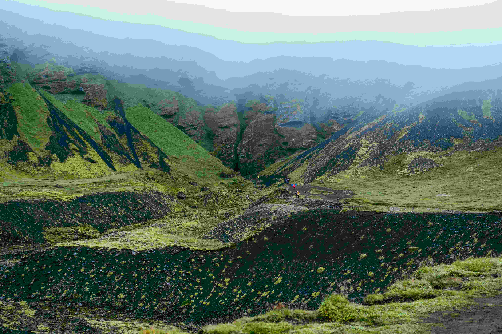

# 覆满苔藓的翠绿山峦

薄雾如轻纱笼住这片山峦，苔藓在岩坡与峡谷间肆意生长，将大地晕染成鲜绿与深绿交织的鲜活画图。**光影**在朦胧中变得柔和，雾气过滤后的光线轻洒在苔藓上，让每一抹绿都裹挟着湿润的生机，仿佛能触到苔藓粘稠的肌理；天地间没有尖锐的光束，只有暖融融的漫射光，为这片天地镀上一层静谧的薄纱。**色彩**上，山坡的翠绿与深绿层层叠叠，如绿丝绒般柔软，与黑色土地形成强烈对比，苔藓的鲜绿在鲜明对比中更显蓬勃，近处山地的深绿与远处云雾的灰调相融，构成丰富的色彩层次，仿佛自然以绿的章节谱写着生命之歌。**构图**上，山谷的纵深与山坡的错落形成引导性视角，将视线牵引向朦胧雾霭中的深处，让山水间的空间感充满悠远与神秘，每一道沟壑都似在诉说着地质与岁月的故事。

这片苔藓覆盖的翠绿山峦，藏着地理与文化的双重密码。苔藓的繁茂依赖于高湿度与低温环境，暗示此处气候湿润且地表温度偏低，可能是地热与降水共同作用的结果；而山地峡谷形态与苔藓覆盖，反映出当地独特地质历程——冰川侵蚀留下的沟壑，后被苔藓群落重塑为生态与景观融合的活力空间。此处不仅是自然奇观，更承载着人与土地的互动记忆：徒步者在山水间亲近自然，感知地质变迁与生态平衡，让这片苔藓山峦成为自然哲学与实践的纽带，在光影与雾气中，传递着关于时间、生命与土地孕育哲学。