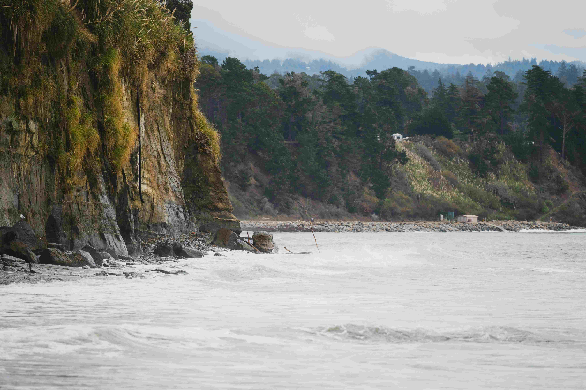

# 冲浪者的海浪诗行

柔和的光影在海岸悄然铺展，薄雾如轻纱笼住天地，为山海晕染出朦胧的温柔色调。画面中，左侧的岩石悬崖如岁月遗落的巨笔，将海洋与陆地的雕琢定格成斑驳图景——枯黄与翠绿交织的植被在湿润海风里舒展，岩石肌理藏着水文变迁的故事；远处山丘被茂密森林拥抱着，深浅不一的绿色流淌成自然的褶皱，与天际线悄然相融。近海的浪涛如被海风轻揉的雪浪，粼粼白浪在蓝灰色水面上跳跃成灵动轨迹，泡沫纹理细腻如诗，每一道浪尖都是自然写就的韵脚。

这片海岸的地理脉络，是千万年海洋与陆地的光影情书。岩石悬崖是海岸侵蚀与地壳运动的印记，山林是生态积淀的见证，而海浪，则是山海对话的韵律。冲浪者的身影于浪间出现，成为自然与人文交织的注脚。古往今来，海洋文化部落早与这片海域共栖共生，海洋是信仰、生计与精神的源头活水；现代冲浪运动，则将自然之力与人类对自由、挑战的渴望系于一脉。冲浪者在浪尖滑行，是自然力与人文精神的交响——海浪的怒放与静谧，映照着天地间的韵律；冲浪者的执着与优雅，承载着人类对自由与创作的向往。在此处，每一道海浪都成为自然史诗的篇章，浪花轨迹是时光的刻痕，也是人文精神的延伸，让山海呼吸与人类心跳共振，成为地理与文化交融的诗行。