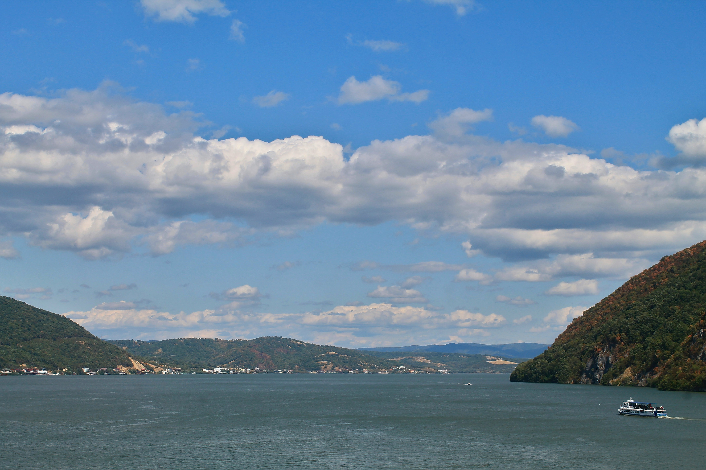

# 多瑙河小银盆：跨界山水间的时光的低语

画面里，澄澈蓝天如无瑕的宝石，云朵蓬松似絮棉，在多瑙河小银盆的上空舒展。阳光轻笼天际，为云层镀上暖金的边缘，天蓝与层次分明的云白交织成为梦幻的织锦。远山如绿与暖棕相间的奏鸣，恰似岁月精织的绒毯；近水似银镜，静静映照着两岸的山林与文明。  

光影在画面中流转，阳光轻洒时，水面漾起温柔波纹，若时光的缎带；山脉与云层光影交错，勾勒出自然的诗意构图，河水、山峦、天空如一幅精心编排的山水长卷。色彩上，蓝天的透亮、云朵的洁白、山林的翠绿与秋林的暖棕交织成和谐色调，每一笔都是自然与人文的温柔吻印。  

这般山水，是自然与文化的辩证诗篇。多瑙河小银盆作为罗马尼亚与塞尔维亚边境的标点，承载着跨越国界的文明脉络。这里的风裹挟着两国的历史余韵，水映着古往今来的文明对话——昔日商旅的帆影、文人画家的笔墨都在山水间沉淀为永恒。河流如历史的纽带，把两国文化紧密相连，而山水则是文化交融的见证者。每一道光影、每一片山水，都在诉说地理与文化的共生故事，让我们在美景中感受到自然与人文交融的深邃诗意，看见岁月在边界间刻下的温柔注脚。