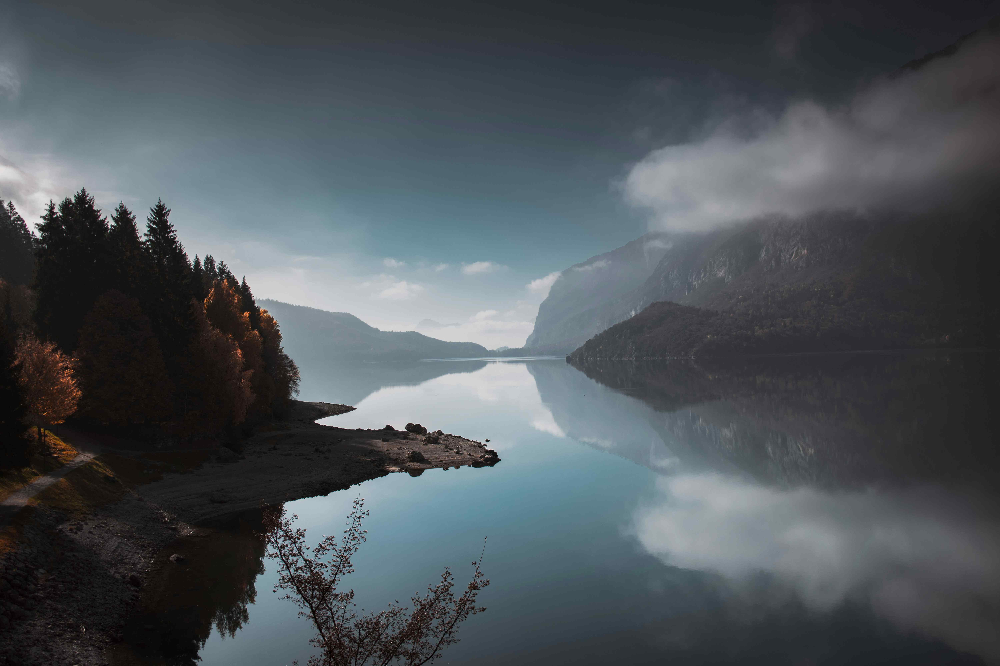

# Lake in the Middle of Mountains During Daytime

白昼时分，山谷间那片湖泊如一卷自然绘就的蓝调长卷，悄然嵌进连绵山脉的怀抱。天空在柔光中晕开灰与蓝的柔缓过渡，云絮似轻绵棉絮，轻拥着山巅。澄澈的湖水如镜面般平静，将天空、山峦与林梢的色彩一一复刻，构成对称而静谧的构图。山峦的轮廓在水面刻下深邃剪影，与云雾共舞；岸边林间的树木，深绿与暖秋交织，为这幅山水画面晕染出季节的温柔回响。光线如轻纱般洒落湖面，将每道涟漪都变成光线的诗行，勾勒出天地间的和谐韵律。

这片湖泊，既是地质变迁的见证，亦是人文根脉的延伸。它或许由冰川雕刻而成，记录着山脉隆起的岁月与水的馈赠。对当地人而言，它往往是精神图腾，民俗传说与信仰在此生长，每一缕山风掠过，都携着地质与历史余韵。百年间，徒步者踏过林间小径至水岸，诗人凝眸崖边，山间静谧成为心灵栖息之所。当日光轻洒，湖面映着山岚，便成了自然与人文交织的咏叹，让山谷间的静美，成为时光沉淀的诗笺，诉说自然与人类永远相伴的温柔。