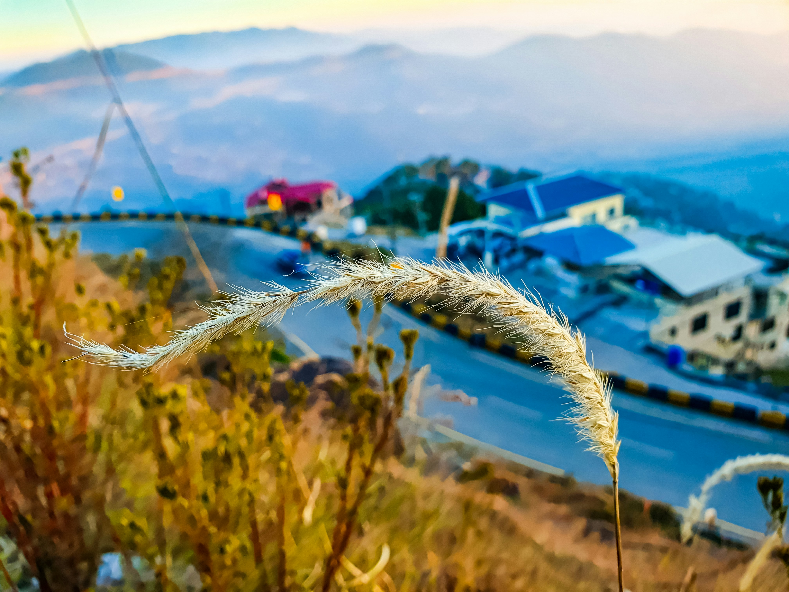

# Hilltop View of the Town

晨光轻拥着山丘，从高处远眺小镇的景致，如一幅被时光晕染的抒情诗画。近景处，独特植物如银白的绒毯，在柔和的光影里闪烁着温润光泽，它们弯曲的穗子似大自然的诗行，为画面铺展了一层轻柔的质感。中景里，小镇的建筑在层峦的蓝调衬映下，漾出暖黄轮廓，红顶与蓝顶的建筑如色彩参差的音符，镶嵌在山坳与蜿蜒道路之间。道路似银线，电线与护栏如无声纽带，连接着前景草木与小镇烟火。背景中，山脉在薄雾里若隐若现，天空晕染着淡蓝与粉紫，光影在天地间荡漾，将远近景致浸入朦胧而沉静的氛围。  

这片山丘俯瞰的城镇，藏着地理与文化的深厚故事。依山而建的格局，本是自然赠与的馈赠与挑战——山体既作防御屏障，也为生活提供庇护与丰饶。建筑错落的造型，见证着时光变迁：红顶承载往昔记忆，蓝顶衔接现代生活，每一处屋顶、每寸街角，都是人与自然共生的注脚。前景植物是土地孕育的鲜活符号，风过时摇曳的姿态，诉说生态循环与土地的慷慨。当目光从草木移向城镇，再投向远山，一种古老和谐感油然而生——自然与人文在山丘视角下，编织成跨越岁月的温柔图景，每道光影、每抹色彩，都晕染着生存、归属的历史与诗意。