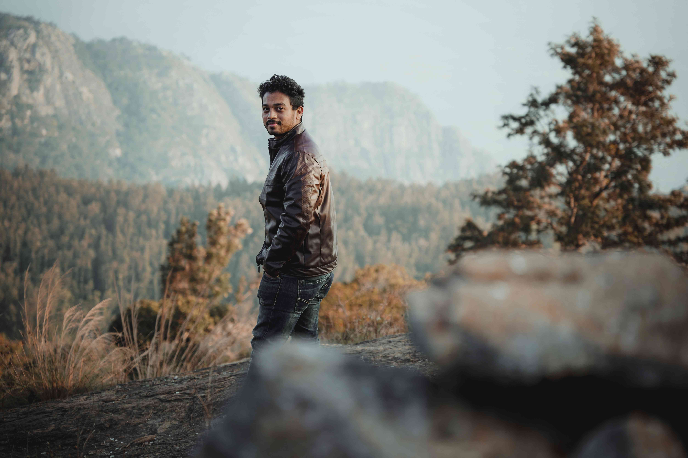

# 棕色苔原上的凝视

暖烘烘的日光轻笼着这片天地，身着棕色皮夹克的人静立草野之上，如与周遭山水缔结了静默的羁绊。画面里的光影似棉絮般轻軟，将每片草叶的轮廓晕染成温柔的暖调。远方的山峦在雾霭中淡成青灰，山体纹理宛如岁月镌刻的史诗，层层叠叠向天际舒展。近处草场泛着厚重的棕褐色，与人物夹克的色调暗暗呼应，仿若大地与行人共穿了同色的外衣，在光影构成的长廊里并肩而行。

空间构图如一幅匠心独运的风景画：前景中那块模糊的褐色巨岩，恍若大地诸缘的亲昵接点；中景里伫立的人，成为视觉聚焦的锚点；远景中绵延的山林与云雾交织，为场景编织出层次分明的朦胧感。色彩自近及远，由暖棕渐次晕开至青灰，恰似自然手蘸诗意画笔，为大地的色彩谱写了逐层晕染的韵律。

这片土地或许承载着历史的回响——那些山峦曾是民族迁徙的路径，森林是世代依存的家园，草场的纹理里，或许镌刻着先民与自然共生的生活方式。当这人静静伫立，他融入的不仅是山川的壮美，更接通了这片土地所承载的岁月、生态与人文共生的故事。风掠过草茎，带过数不清的岁月气息，都在这光影交织的瞬间，凝为了一曲人与大地共舞的诗行。