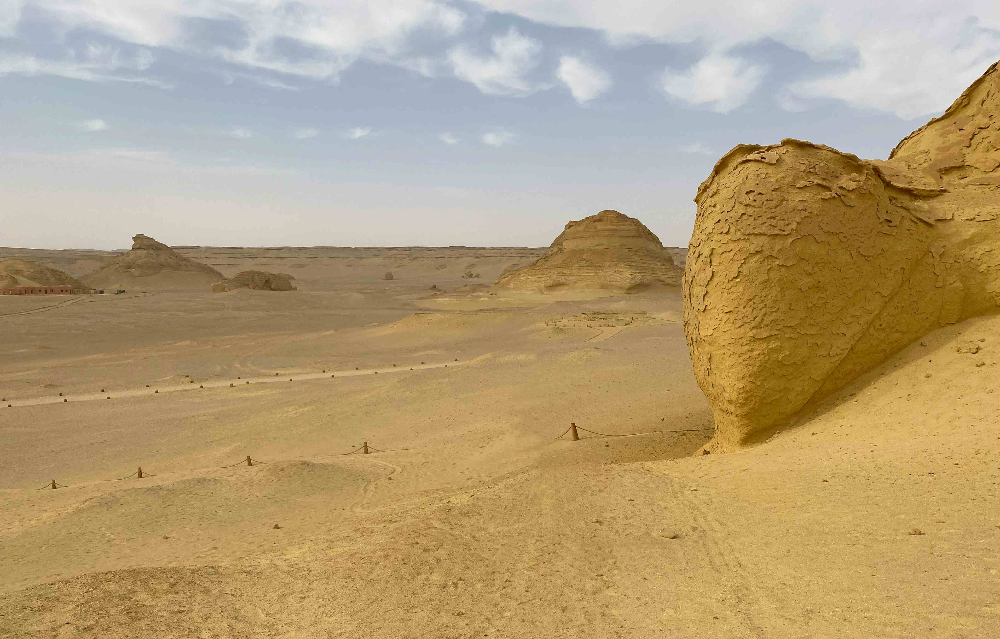

# a large rock in the middle of a desert  

阳光如暖浪浸润这片黄沙，沙漠中那座巨岩宛如时光铸就的雕像，傲然矗立在广袤沙原之间。光线轻抚岩石肌理，金红与浅黄的层次在风化褶皱里流转，明暗交错的韵律，正是沙漠永恒的呼吸脉搏。巨岩于沙海中独成一尊，其轮廓在苍茫天地间格外醒目；远处的岩体如远古纪念碑，层层叠叠，随视距渐远消融于地平线，构图构建出深邃的空间感，似天地向那处巨岩诉说什么亘古秘事。  

色彩之上，沙漠暖黄与岩石褐金浑然一体，形成和谐的“大地色调”主调；天空的淡蓝如轻柔丝缎，几缕云絮轻挂，为砂石景致添了份温婉诗意。光影在岩石褶皱间穿梭，亮处似灯火摇曳，暗处似岁月埋下的棋局，每一道裂痕都盛着时光褶皱，每一寸肌理都藏着沧桑叙事。  

此巨岩于黄沙之中，实为自然与人文的交汇坐标。风沙是雕琢者，岩石本为时光书写者——它是否曾为古代部落的圣岩？是否是商旅辨认方向的标志？岩层纹理封存着地质变迁与文明脉络，每一次光影变换，都是沙漠文明秘史的轻声低语。巨岩如沙漠灵魂的烙印，承载着自然坚韧与人类记忆的双重重量，每一次凝视，都在触碰大地沉淀的厚重与文明传承的谜题，也在触摸沙漠永不放弃的坚韧与背后绵延的历史诗篇。