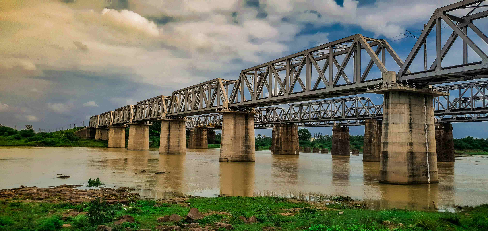

# Gray Concrete Bridge Over River Under Cloudy Sky During Daytime

天空被厚重的云层包裹，却在日光里漾开淡青的底色。云絮如棉絮般轻柔，在桥身与河面之上投下朦胧的明暗变化。灰色的混凝土桥梁横跨河流，钢铁结构在光影中棱角清晰，却为柔和的漫射日光温柔晕染。桥墩如巨大石柱矗立水间，混凝土的暖棕色与银灰色钢铁交相辉映，在泛着暗褐之色的河面上投落斑驳的影子。河水似承载着岁月沉淀的色彩，与两岸翠绿正面相拥，岸边草甸与石块点缀其间，为工业感的桥梁注入自然的温软。  

光线从云隙漏下，给桥体、桥墩与河面添一层薄薄柔光，构图里桥梁线条向远方延伸，仿佛将河流两岸的历史与未来连成一线。这桥梁不仅是工程的奇迹，更是地理与人文的纽带——河流在区域文明中是滋养万物的脉络，而桥梁的建造见证了人类驯服自然、搭建连通的精神。它见证了运输脉络、生活往返，更承载着当地文化与历史的风貌，如同一本凝固的时光史诗，诉说河流两岸的烟火与变迁。观此画面，能感受到自然与人工的共生之美，更能懂得一座桥如何成为地域精神的符号，在风云变迁的天空中，静守河水潮起潮落，见证文明延续与情感交融。