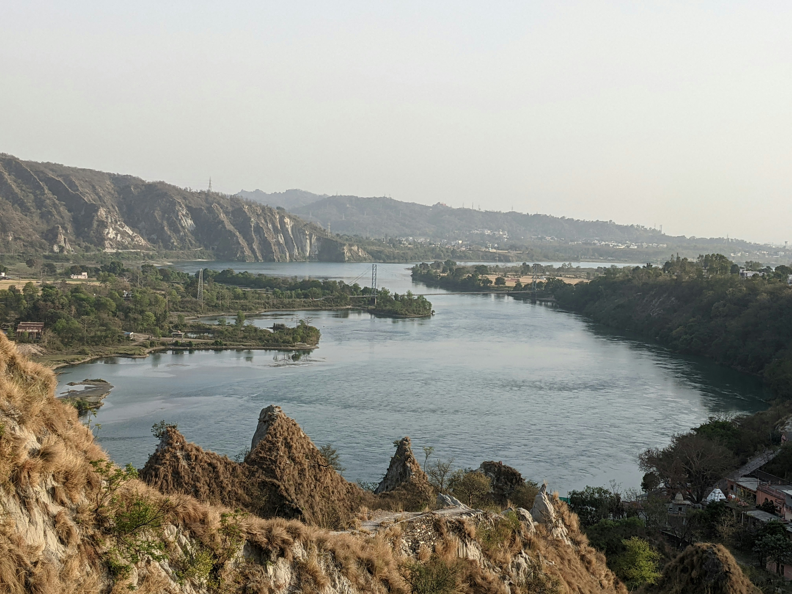

# 绿色的树与棕褐的山：水域边的时光诗意

晨光轻拂层叠的棕褐山峦，那些被岁月雕琢的岩石，以温润的土褐色调承载着历史的脉络。近山的斜坡上，枯黄与翠绿交织，棕褐岩石的肌理间，绿色树木如灵动的墨痕，在柔和的白日光影里舒展枝桠，为沉静的山境注入蓬勃生机。  

画面的色彩层次深远而和谐：棕褐山体如深沉的诗行，深浅交错的纹路诉说地质的沧桑与时光的故事；绿色树木是跳跃的灵韵，为山野添了鲜活的气息；水面以澄澈的蓝调铺展，似一块被岁月打磨的宝石，温柔收揽山的雄浑与树的蓬勃。构图上，远山连绵成温柔的轮廓，水域如婉约丝带贯穿其间，近山的岩石与树木则以错落层次，将山水与人文景致紧密勾连，构建出一幅自然与人文交融的诗意长卷。  

这方山水之间，是地理与文化的深情对话。这片水域与山峦，或许是文明古地的脉络，河流曾滋养世代居此的人们，而山与水的相依见证着农业文明的兴衰，岩石与树木的历史，更承载着当地人文对自然的敬畏与利用传统。每一道山体的褶皱、每一片树叶的舒展，都在光影与色彩中，诉说着人与山水共生的故事——河流与土地的馈赠、树木为古老村落提供的荫庇，这些都在景致里，成为这片土地文化传承的鲜活注脚。而光影流转间，山水也对过往的岁月轻声倾诉，让自然之美与文化之根在风物中深刻共鸣。