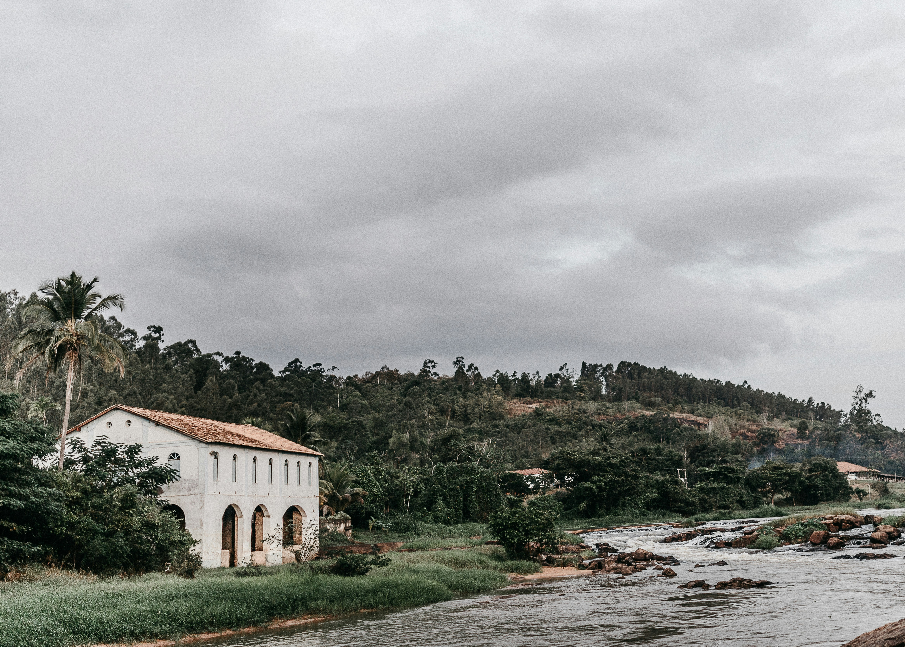

# 岁月静好的河畔记忆

在多云的白日光影里，河畔那座老建筑静立，如时光封存的叙事诗。灰调天空如轻柔纱幕，将柔和光晕洒向建筑之身。建筑的白墙泛着岁月的旧韵，红褐之顶与墙面形成温润对比，林影于墙面摇晃，如淡墨勾勒诗意轮廓。周边绿树似洗净的翡翠，团簇环绕，与墙面老白、天空灰调相映成章，色彩层次如自然与人文的共生调色。  

构图之上，建筑居于画面左下，河水于右岸舒展，远山森林构成深远的层次。建筑拱廊线条、河水分流韵律、山坡林景相互呼应，空间里暗藏天地人三者的调和之境。河水水墨质感暗沉，却因岩石点缀添灵动；树木与建筑共同织就静谧生态画卷。  

回望背后的地理文化，此处景致是历史人文与自然生态共生的佳证。老建筑或曾承载区域产业记忆，依河而建仗水运之势，周边茂林兼具生态与人文符号价值。时光沉淀下，建筑见证岁月更迭，树木与河流承载自然呼吸，三者诉说区域发展与生态共存的密码。如今，它在云雾光影间静默，既是历史风华的凝固，也是自然与人文共生密码的一卷，让凝望者感知历史与自然的温柔回响，体悟天地人之间的和谐暗喻。