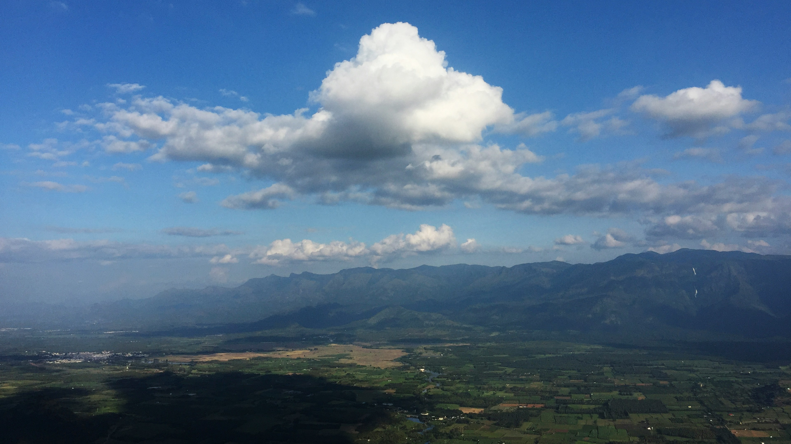

# The Mountains Glimmed Through the Skies  
当飞机振翅于长空，这片山脉的意境如一首悠长的抒情诗，悄然展现在眼前。澄澈的蓝天如纯净的宝石，大团云朵宛如蓬松的棉絮，自山巅缓缓舒展，光影在天地间织就灵动的网络。深绿色的山体在光与影的交错中，呈现出层次丰富的肌理：阳光吻过的峰峦泛着金色边缘，阴影裹挟的纵深透着沉静的悠远，每一道棱皱都藏着大地与时光的私语。  

下方的大地如一张被绘画的彩缎，绿与黄在田野间交织，形成错落有致的纹路，村落的轮廓在朦胧的薄暮中隐约浮现，与山峦构成悠然和谐的天地构图。  

这方山水是自然与人文共酿的文化史诗。山脉的褶皱里沉淀着历史的风烟，山间或许承载着古老村落的农耕智慧，云雾缭绕的山谷投射着人文的古韵与传承。当从高空以旷达的视角凝望时，眼前的山水不止是自然造化的壮美景致，更是地理文明与人文精神的深情兑现——每一道山脊的弧线，都系着当地文化的根脉；每一次光影的流转，都在诉说这片土地历经数千年的故事。而自然与人文的相融，让这片山河成为一座无声的史诗书，承载着人与山、与大地共生共栖的诗意与厚重。