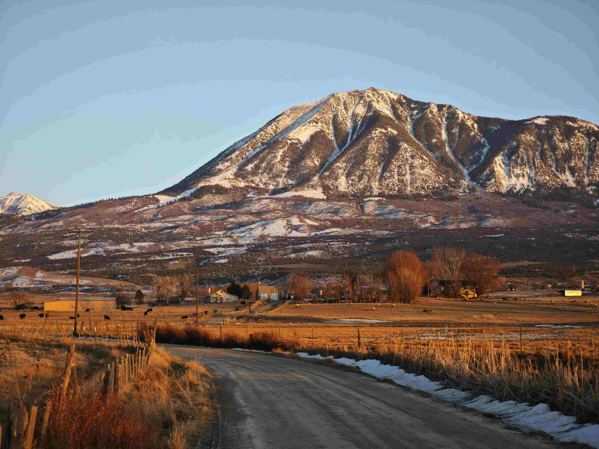

# A Dirt Road in Front of a Snow-Covered Mountain

当目光逾越蜿蜒的土路，那座雪山如沉默的巨擘横亘天地间。雪的气息在风里轻漾，融雪的边缘被阳光晕染成柔和的金边，在山体表面划出细腻的光痕，将山的轮廓衬得格外雄浑；土路的肌理清晰可感，车轮碾过的纹路与边缘零星的残雪交织，如大地刻下的诗行，向远方延伸。田野在暖金色的光影里苏醒，枯黄的草茎沾染阳光的余温，化作大地独有的暖调，与雪山冷冽的白色形成层次分明的色彩对话。远处的房屋隐于暗绿的树影间，古朴的轮廓与自然交流，似是岁月为山间生活预留的温柔居所。

这片景致中，雪山、土路、田野与村落编织出地理与文化的深邃故事。雪山是自然的威严叙事，积雪沉淀着时间的厚度与季节的韵律；土路则是人文延伸的脉络，连接着农耕文明与时代的脉搏。旧屋错落于山水之间，是人与山在岁月中磨合出的安稳，而远处游动的牲畜、开阔的牧场，都承载着对土地与自然的驯化智慧——在这里，人与自然共呼吸，以土路为径，以雪山为幕，书写出关于顺应与共生的地理文化史诗。暖光将山的亮部与暗部晕染得格外清晰，却始终坚守着与天地合一的禅意，让每一道光影都成为文明与自然对话的注脚，在无声的山野间，载着人与土地的深情与故事。