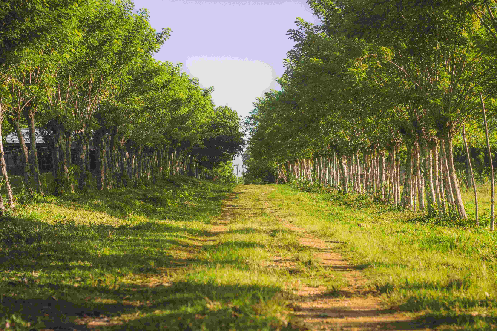

# Nature Trail Enfolded by the Embrace of Green  

在这片被树木温柔环抱的自然步道上，时光仿佛凝滞成一幅静谧画卷。阳光以温婉的姿态穿透枝桠，在土路和草地上缀满斑驳光影，像是大地写下的随想，每道光痕都流淌着自然的呼吸节奏。  

树木的色彩是生命的交响乐章——新叶呈现出醉人的浓翠，如翡翠般鲜亮，树干却带着岁月沉淀的斑驳质感，与土地的暖棕、草地的青葱交织，构成一曲和谐的自然赞歌。构图上，那条蜿蜒的小径如时光之链延伸向远方，两侧树木整齐又自然地列成边界，将人引入一场与自然的深度对话，每次脚步踏过草叶，都是对这片绿野魂魄的亲昵问候。  

这条自然小径，是地理与人文共同镌刻的印记。在无数地域文化中，林间步道曾是先民探索资源、传递故事的生命通道，它凝练着人与自然千万年的共生智慧。当我们在光斑下缓行，风过树叶的轻响、泥土的温度，都是对古老生态记忆的重新唤醒。这里，自然不是被观赏的对象，而是生命的精神归宿，每一寸绿意都承载着地理的厚重与文化的温柔，让现代人在步履间寻得心灵的归处。