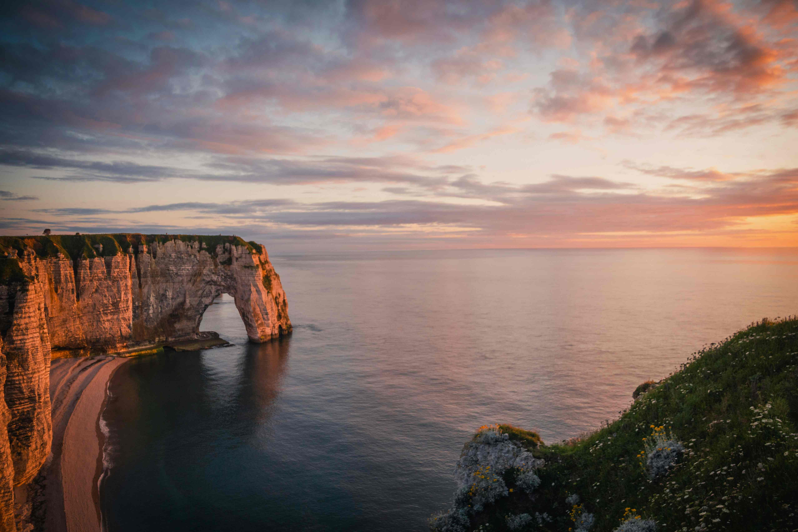

# 拾光里的地质诗行

在时光的轻触下，这片海岸景致如一首被温柔安抚的诗章。画面中，棕褐与青绿交织的岩石矗立在海天之间，似大自然匠心独运的艺术雕作。灰云如沉静的帷幕，在天际铺展时，为景致添上了苍劲的底色；暖光轻笼罩岩石，浅褐与青绿在岩体上洇开，恰似岁月沉淀的色彩脉络。  

岩石的轮廓如史诗化的雕塑，庞大的拱门与陡峭的崖壁相互呼应，将辽阔的海面与无尽苍穹轻轻牵拽。海面的波光映着天空的色彩，粉橙与灰蓝在水面漾成温柔的虹彩，仿佛天地间的温柔与坚韧都在这一瞬凝固为光影。右侧山坡上，翠绿与繁花交织，为雄奇景观添了份柔曼的生机，让震撼之中不失温婉。  

这岩石的生成，是地质岁月与海洋力量共同书写的沧桑史诗。亿万年前沉积的岩层，经千万年海浪冲刷与风化侵蚀，方成就这般雄奇壮美的模样。而这样的地貌，从古至今都是艺术灵感与人文记忆的源泉——它承载着自然的永恒震撼，也承载着沿海世代与海为伍的生活印记，是地理与人文共振的文化符号，每一次凝视，都是对自然与人文交融生辉的回望。