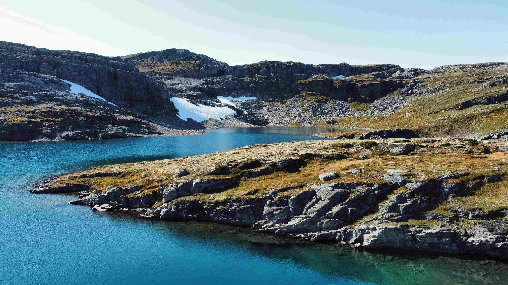

### 山间积雪与碧水相映的秘境

当目光轻落于这片山水间，时光仿若在此抻长了步子。阳光以温柔的笔画，为苍莽山脉铺展银灰与锈褐交织的纹理，那片湖水则像是被时间淘洗过的宝石，以澄澈幽蓝为底色，静穆地环抱着四周的山岩与草甸。山体岩石如千万年的史诗，粗糙的纹理与层理在光影中起伏跌宕，深灰与赭褐的色调里，藏着地质变迁的痕迹；山间积雪如银白信笺，轻拥于岩坡，化着溪水滋养着边缘草甸，金褐与青绿的草色在岩石间错落，像大地天然绘就的水墨篇页。湖水与山岩、草甸交织的构图，是山水共舞的立体乐章，近岸浅水处透亮的碧色与远岸深邃的湛蓝渐变，光影于水面与岩壁间跳跃，为静态景致注入灵动气息。

这般山海相拥的图景，是地质与岁月共同书写的华章。冰川曾以冰刃雕琢层岩，溪水汇聚成湖，成为山地生态的明珠。在地理文化的脉络里，它既是自然馈赠的景观，更是人与山水交往的见证：古时先民敬畏此地的原始力量，今时旅人于山水间寻得心灵归处。每一道山岩的裂痕、每一处草地的起伏、每一缕湖光的柔波，都承载着岁月与文明的生命密码，像湖水包容万物，也包容着人类对自然的敬畏与探知，将山水间的故事缓缓漾开。