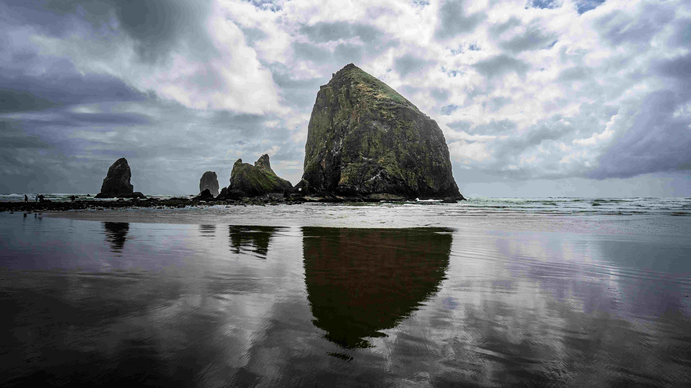

# Canon Beach in Oregon

阴云如墨色纱幔漫过天际，柔和的漫射光为这片海岸晕染出静谧氛围。巨岩如时间的雕塑，挺立在浪涛之上，深灰与苍绿的肌理在风里舒展，苔藓与岩层的纹理，似千万年自然雕琢的诗篇。退潮后的水面如镜，巨岩的倒影与天空的云影交织，在沙滩上漾开光影的涟漪，构成一幅水墨般澄澈的画面。  

海水泛着幽蓝与灰紫的色彩交融，像历史沉淀的绸缎轻拥岩石根基，每一道浪纹都在诉说海岸千万年的侵蚀故事。远处错落的岩峰如自然摆下的雕塑，与中央巨岩共同演绎地质运动的史诗，岩石的棱角与海水的柔波，在光影中达成无声的对话，构成层次丰富的视觉交响。  

这片海岸不仅是地质奇观的疆域，更是文化韵味的载体。对俄勒冈沿海的原住民而言，这片海域承载着祖先与海搏击、与浪相伴的传说，巨岩与海滩是历史记忆的标点。当镜头捕捉这一刻，自然的力与人文的温情在此交汇——巨岩的沉默、海浪的呼吸、云层的私语，在时光长河里，诉说人类与自然共生的千年故事，也将地质变迁与人文相传的深情，永远留存于光影与纹理间。