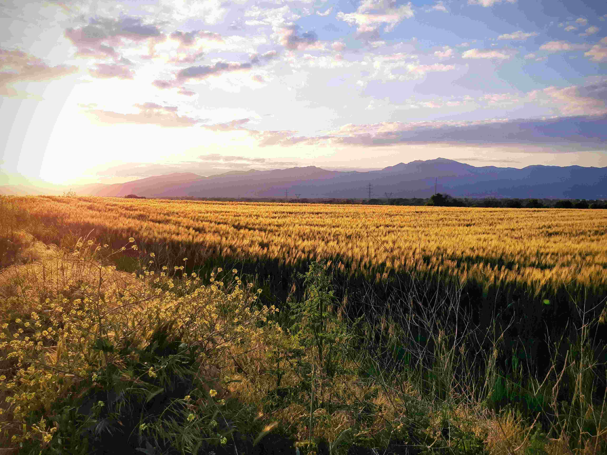

# A Field of Grass with Mountains in the Background  

夕阳的余晖如金丝细缕，轻笼这片草地。草在光里漾着暖黄的波纹，每一株穗芒都沾着阳光的温软，像是大地赋予的轻轻吻触。光影在草踝间铺展，明暗交错处漾起流动的光泽，仿佛一群chartreuse活动着的小精灵。天空渲染着淡粉与靛蓝，云团似轻薄的纱，与远处的山脉相拥。山脉在暮色中化作蓝紫的绸幕，轮廓柔缓如岁月的褶皱，将自然的沉稳与草地轻柔的蓬勃交融。  

色彩是大地馈赠的礼赞，金黄与青绿在风里交织，明亮的暖调中晕着幽远的冷意。近景的小花与草茎，以暗绿与明黄织就的前沿，引向中景蓬勃的金色草地——那片如鎏金丝绒的广袤，再延伸至远处山脉与天空相接的边界。构图如时光的画框，将自然的高低层次纳于其中，从近景花草的细腻到远景山脉的悠远，每一层都承载着大地的故事。  

这片草地与山脉的交融，是地理与人文共酿的诗行。山脉曾为古村落提供屏障与水源，草地是农耕文明的绿洲，百年来，先民们以这片土地为画布，印证了人与自然的共生哲学。阳光穿过云层洒下的瞬间，是时间在地理上留下的注脚，每一块土壤、每一缕风，都藏着历史脉络。当光影在草地上跃动，也在诉说山脉与平原的对话，人文与自然的和解，以及大地永恒的呼吸。这片景观不仅是视觉的盛宴，更是地理与文化的共同叙事，将自然的壮美与人文的温润，织进时光的经纬里。