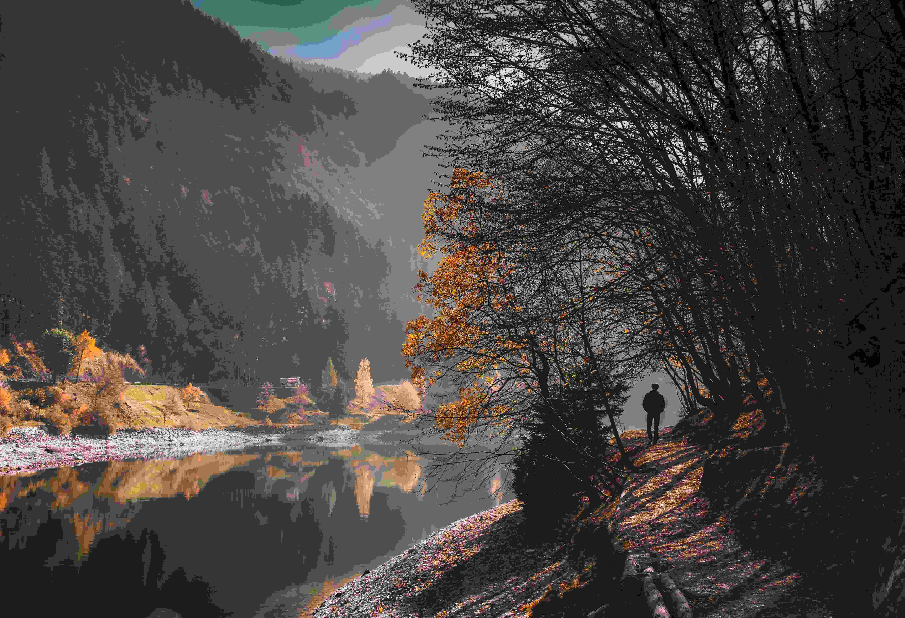

# 时光凝于水的眸边  

晨雾为山水披上薄纱，光线从山巅轻柔漫落，给天地晕染出朦胧的诗意。画面中，水体如镜，将岸边的树木与远山的轮廓巧妙映入，光影在河岸石滩与林间交错，那些褐黄的秋叶、深浅叠嶂的树影，共同织就秋意与静谧相融的画卷。  

岩石之上的人影静立，与周围景致开展一场无声的温柔对话——他似在与山水诉说亘古的联结，亦如自然山水写给人类的篇章。色彩是画面的魂魄，深邃的河水与树木绚烂的秋装形成鲜明对照，暗调的山林如沉默的守护者，亮部秋叶与水面的温婉反射，为整个画面注入呼吸般的韵律。构图上，人物与水体位置错落，远山朦胧与近岸清晰的景致制造出空间纵深感，仿佛在引观者踏入这自然褶皱里的故事。  

这般景致，何尝不是地理馈赠的瑰宝？河流是文明的脉络，山脉是文化的脊梁，四季更迭在此处写下又一段动人的注脚。当人站在岩石之上，触碰到山水间的风与光，便牵动了自然与人文最鲜活的共鸣。在这光影、色彩、构图交织的瞬间，我们读懂山水蓄积的故事，也读懂自我与辽阔天地共生的绵长温柔。