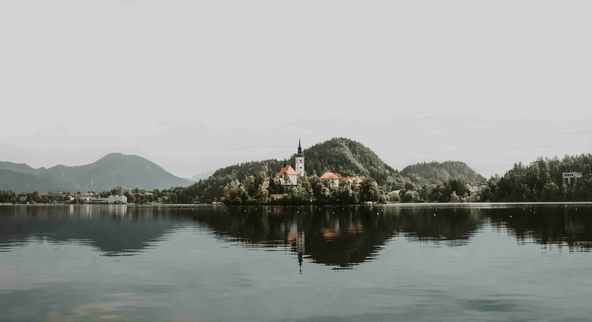

# 山旁湖泊之晨  

晨光轻笼这片水域，如镜面般承接着天地意象。湖水澄澈得能映落山的轮廓与建筑的尖顶，山峦在薄雾里晕开层次分明的绿意，像大自然轻远景画的笔锋。红顶白墙的教堂从林间浮现，阳光为它晕染出暖调的光晕，与周遭葱笼的树影、静穆的山峦相映成趣。天空是灰调的温柔信笺，将光影碾成细腻的滤镜，给山水披上柔和的光衣，让倒影与实物在水面共生，构成一幅静谧的春天的画卷。  

这方山水与人文的交融，是地理与文化的诗意互诉。布莱德湖的静穆，承载着历史的回响；圣玛丽岛教堂的肃穆，是信仰与艺术的凝眸。此地山水相依，是自然造化的馈赠，更是人类文明在山水间扎根、生长的故事——山脉护佑着湖泊，湖泽滋养着人文，教堂与自然的共生，诉说着世代相传的信仰与审美。每一次山影照在水上，每一种色彩交织成景，都在诉说天地共生的智慧与人文延续的热望，让这方山水成为历史的静影，也成文明的注脚。