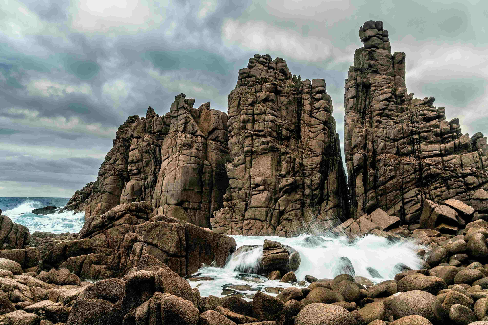

# Brown Rocky Mountain Near Body of Water Under Cloudy Sky During Daytime

当目光倾注于这片景致时，那片棕褐色的岩石群如同沉默的铁铸雕像，从海面径直刺向灰蒙蒙的天际。阳光以温柔却坚定的姿态铺洒，将岩石的肌理清晰地展现在眼前——粗粝的表面在光影中泛着温润的棕调，岁月与海浪的雕琢，在岩体上镌刻出沧桑的故事。海水如活泼的灵韵，白浪汹涌地拥抱着岩石，溅起的水花在光线下泛着冰晶般的蓝白，与岩石的暖棕色形成绝妙的色彩对话。云层如轻纱般包裹着天空，将日光滤得柔和，为整个场景蒙上一层忧郁却诗意的氛围。构图上，岩石的垂直雄浑与海水的流动灵动形成强烈对比，天地的边界在岩石的磅礴中显得悠远，却又因海水的低语悄然亲近。  

这片地貌是地质变迁的生动注脚——千万年海浪冲刷、风力侵蚀，将地块雕琢成这般震撼的岩柱群。在当地文化脉络里，这样的海岸线是祖先与自然对话的见证：渔人依赖这片海域生产生活，智者敬仰由自然雕琢的雄奇景观，岩石既是大自然的奇观，也是文化基因中情感共鸣的载体。当潮起潮落，当云卷云舒，岩石在时光里叙说沧桑，也让旅行者触摸到与自然相连的历史温度。