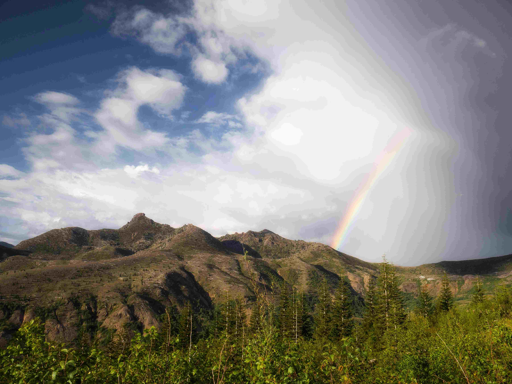

# 绿野晴空中的山色诗行

当白昼将呼吸倾注于天地，这片风景成为自然最生动的诗行。柔和的光影如丝线，在蓝天与山峦、草地与云霞间织就温柔肌理。深浅交错的云层，或蓬松如棉，或厚重如墨，给苍穹绘出明暗的韵律，阳光透过云隙洒下，给山峦镀上金边，让岩石的纹理在光影里显露出岁月的沧桑。碧绿的草场如大地织就的锦缎，从山脚下延展至远方，与山林、山石相映成画，生机与静谧在此刻达成了和谐的共鸣。  

当目光追至远山的轮廓，一道彩虹悄然铺展，七彩如灵动的丝带，把山野与天空的色调融成诗意的联结，这或许是雨过天晴时自然留下的奇迹，更是天地共赏的温柔瞬间。  

这片山水不仅是地理上的存在，更是文化的脉络。山体形态承载着地质变迁的故事，草甸生态见证了岁月里的生命循环，而蓝天与彩虹组合的壮丽景致，又诉说着人类与自然共生的情感。在此处，先民的迁徙、游牧者的逐草而居，都成了山水间的传说；诗人的笔触、哲人的思考，也成为了这片天地精神的延续。每道光影、每片青绿、每处山峦的轮廓，都在诉说自然与人文交织的永恒故事，让我们在凝望时，重拾与大地相连的根脉与温柔。