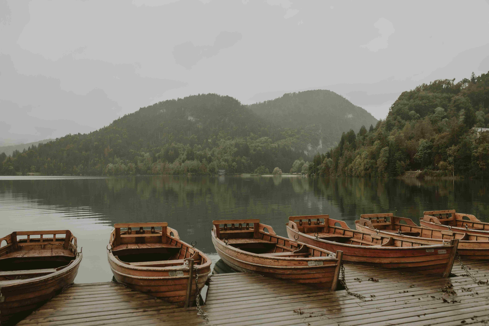

# Brown Wooden Boats on a Tranquil Lake

在朦胧的白昼光影里，几艘棕色木船如隐于时光褶皱中的觉者，静静停驻在湖岸的木质码头。木船的纹理承载着岁月的温度，每一道细微的裂缝都洇着时光的呼吸——暖棕色的船身被柔光轻吻，在木纹间漾开温润的光泽。远处湖面如澄澈的镜，将两岸山林倒映成半虚半实的梦境，薄雾为苍山翠岭笼上轻纱，将光影碾成温柔灰调，让山风都成了裹挟诗意呼吸的媒介。画面构图如一首静默的诗，木船从近到远依次排开，构成空间向自然的延伸，湖水的平波、山林的黛色、木船的暖棕，在层次间织就宁静的地理肌理。  

这样的场景常出现于山水相依的秘境——这里可能是某座高原湖泊，或被群山环抱的丽水不通处，木船是人与山水千百年相依的见证。在过往的岁月里，它们是运输的舟楫，是渔人逐浪的矢量，是旅人抵达心灵静域的渡船。每一艘木船都负载着地理与文化的双重记忆：山间的水源养育了木船的用料，工匠的手艺熬成了木船的温存，而湖水的温柔则养活着木船承载的故事。从传统渔猎文明到现代旅游开发，木船永远以木质的存在，维系着人与自然的亲昵关系——它不是冰冷的交通工具，而是文化血脉里的一脉悠长，是自然与人文相拥的 enchanted 纪念。  

在这样的画面中，时光仿佛慢了下来，木船、湖水、山林共同谱就一曲关于存在与共生的乐章，让每个凝望的人都能触摸到自然与人文相拥的温柔韵律。