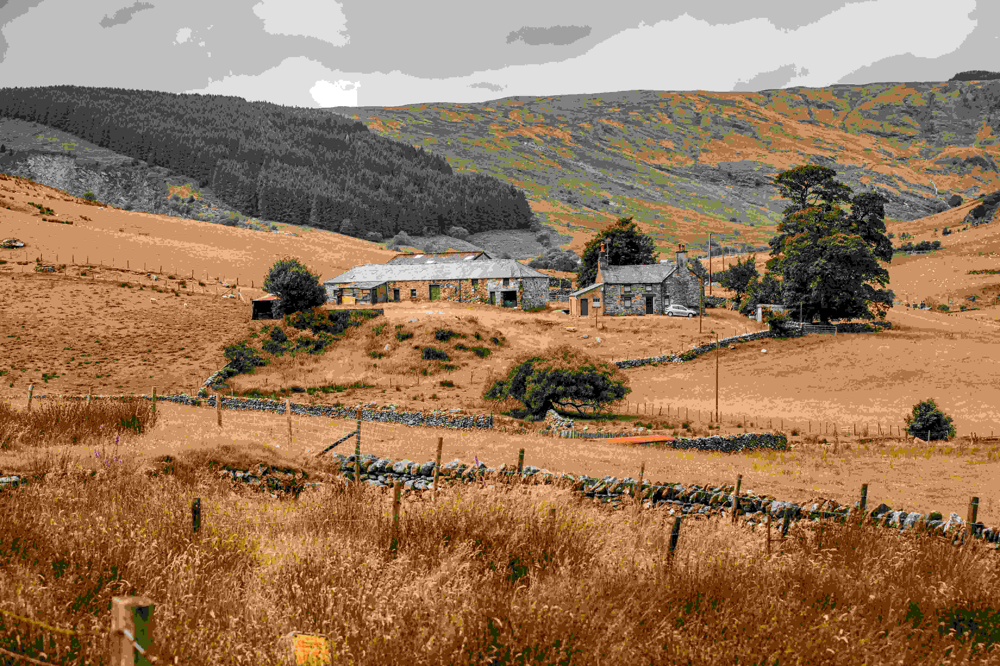

# 山野间的诗意栖居

欢明的日光裹挟着自然色泽，铺展在连绵的山野之上。画面中，白棕相间的石屋错落于棕褐草地间，远处山脉如岁月轻抚过的褶皱，色彩在灰绿与焦褐间交织，构成一幅宁静又饱蘸韵味的田园图景。  

光影在此间舒展成温柔的诗行：暖日将草地的棕褐晕染得像是时光漾开的波纹，石屋的素色在光影下有了冷暖交融的层次，灰绿的屋顶与白棕的墙体相映成趣，远处山峦被光线切割成深浅不一的色块，如同大自然绣就的巨型挂毯。构图上，房屋居于画面核心，草地的层次感与远山的纵深感交织出和谐的车轮脉络，石墙、疏林暗合着“天人合一”的隐秘气韵，每一处景物都在诉说山野与居所的共生智慧。  

这一方山野，承载着深远的地理文化故事。石屋以乡土物料塑造，是当地先民与山水对话的痕迹——石材取自附近山体，榫卯结构与石墙呼应着农耕文明的工匠精神；棕褐草地或是传统放牧与耕作之地，山脉为村落提供屏障与水源，这片土地上每一次劳作、每一处生活，都晕染着与自然共生的哲思。当光影穿过屋檐洒在草地上，它不仅是视觉的审美，更是时间沉淀的文化留痕，让山野间的诗意，悄然浸透在石屋与土地的呼吸里。