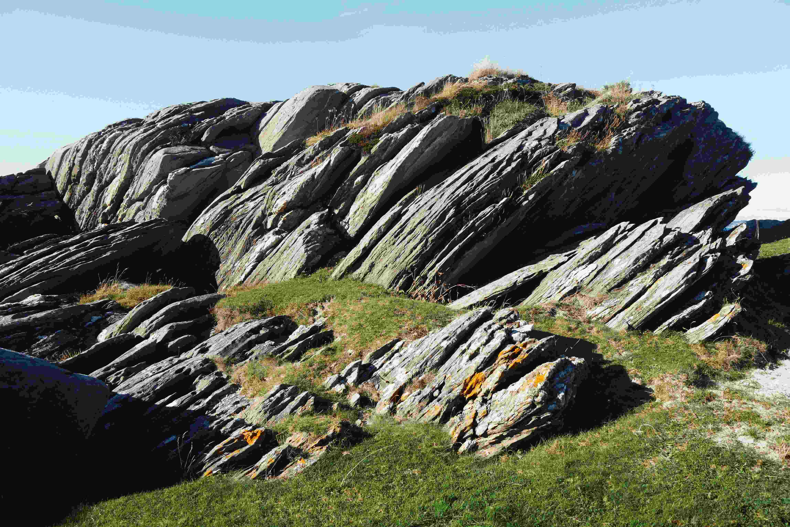

# A Rocky Outcrop with Grass on Top  

阳光轻洒在层层叠叠的岩石上，光影在岩壁的褶皱间流动，勾勒出大地赋予的粗壮轮廓。岩石以深沉的灰调为主，那些被时光雕刻的裂痕与纹理，宛如一本记载岁月的无字书，青绿与橙黄的痕迹，是苔藓、地衣在千万年岁月里晕染的色彩，每一处凹凸都藏着冰川、风化的故事。岩石顶上与缝隙间，草以倔强的姿态生长，鲜黄的草茎、深绿的草叶如细碎的绿毯与金丝，在冷峻的石面轻轻舒展、攀附，为硬朗的岩景添了温柔扎根的生机。  

这片岩石露头，是自然与时间对话的见证。亿万年的地质变迁，将岩石雕琢成历史的硬质注解，而草则是生命恒常的柔软注脚。当目光沉醉于岩石纹理与草的生机交织的画面时，仿佛听见岁月在石隙间低语——岩石见证过冰川的覆辙、文明的悠远过往，草却又以蓬勃姿态，在坚硬的面上书写生命的温柔抗争与生生不息。在这方天地，岩石与草的共存，是自然法则里动人的平衡，也是地理与文化深度交织的缩影，让观者从中感受到时间沉淀的厚重，与生命跃动的轻悠，每一次凝视都如触摸一段凝固的历史与鲜活的未来。