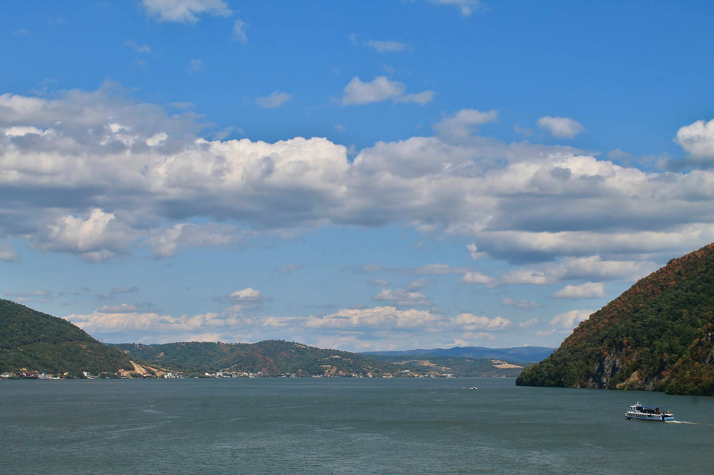

# 观赏多瑙河小壶的视界  

当目光穿透云层的轻纱，映入眼帘的是一幅由光影编织的诗意长卷。蓝天如澄澈的宝石，云朵似蓬松的棉絮，阳光在山峦与水面间洒落灵动的光斑，为这片天地赋予呼吸般的动态韵律。水面泛着静谧的蓝绿色，如镜面倒映着天空与云的形色，山峦环抱间，植被与岩石在光影下层次分明——深绿与暖褐交织，仿若自然以色彩刻画岁月的纹路。远处岸边，零星的聚落散落在山河褶皱中，白色与暖色调的民居，像历史长河里泛着暖光的篇章，静静诉说着这片土地的烟火与传奇。  

这片水域之上，是著名的多瑙河“小壶”（Small Cauldron），处于罗马尼亚与塞尔维亚的边境地带（塞尔维亚在右侧，罗马尼亚在左侧）。从地理与文化的维度看，它是景观分野与文明交融的见证：多瑙河作为天然边界，承载着两国历史长河中文化碰撞与民族融合的脉络。古往今来，这里见证太多文明印记——罗马帝国时期的文化渗透、中世纪商旅带来的文化交融，直至现代仍作为两国友谊的纽带，自然山水与人文历史在此处形成有机整体。  

山峦间光影流转，水面漾起的波纹温柔如诗，船只似跃动的音符划破平静，又悄然融入这片山水韵律。此地不仅是地理分界，更是文化融合的见证者。当目光触及山水，能感知岁月在河口与山峦间沉淀的，不仅是地理轮廓，更是族群记忆与文明基因的传承。当光影穿过云层，也穿越历史烟云，让每一道山色、每一寸水光，都成为跨越国界的文化注脚，将自然诗意与人文故事凝于这片边境水域，成为永恒的精神图景。