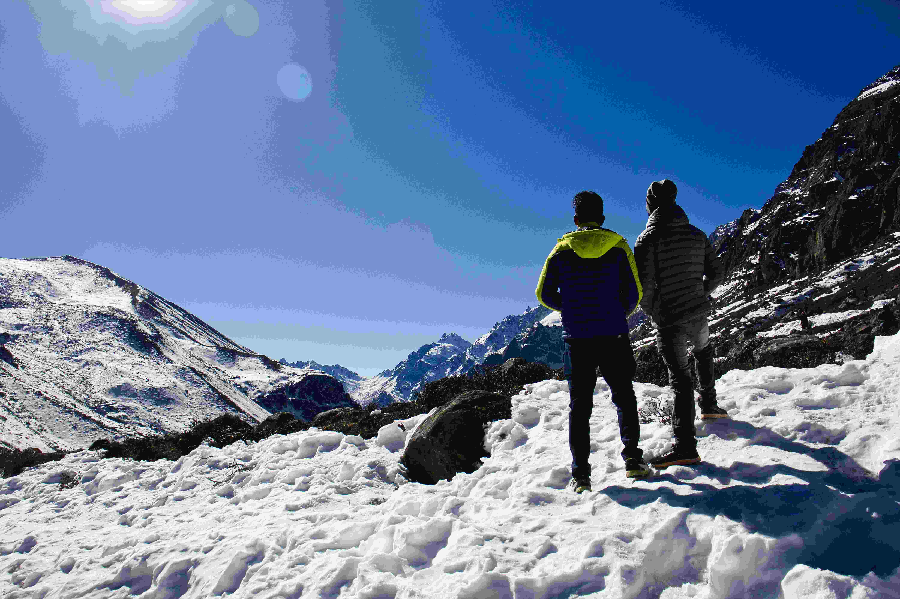

# 雪域脚下，人与山的诗意对话

在光影交织的质感里，这片覆雪的天地正演绎着天地与人文共生的美妙叙事。阳光似银线轻轻垂落在雪地，让结晶状的雪花泛出温润光斑，黑白相间、纹理分明的岩石与莹白无瑕的雪景形成强烈视觉对冲，纯净得近乎诗意。澄澈蓝天以纯粹的蓝为底色，与远处连绵的雪山共同铺展出苍穹与大地共舞的壮阔壁绘，色彩与光影在此刻编织出野性与温柔同生的气韵。  

画面构图里，两人静立于雪地中央，身影成为连接天地与人类的天然纽带。那件亮黄外套如跳跃的暖意外壳，在冷调雪原中漾开亲和气息，与周围苍劲的山岩、纯净雪景形成和谐碰撞。背景中，巍峨的雪山似沉默的巨神，以磅礴姿态守护这片天地，而覆雪覆盖下的地理肌理，见证着岁月与自然赠与的雕琢与馈赠。  

这般雪域之景，既展现天地造化的震撼力度，更承载着人与山的千年羁绊。于高海拔的地理格局下，雪山不仅是自然的生态屏障，更是文化精神的永恒图腾——当地居民以雪山为生计依托与精神信仰，而徒步者的脚步，延续着探索自然、尊重生态的人文传统。当阳光在雪地上写下时间的刻度，我们看见的，是自然之美的鲜活现世，也是人文与地理在血脉里传承的诗意。