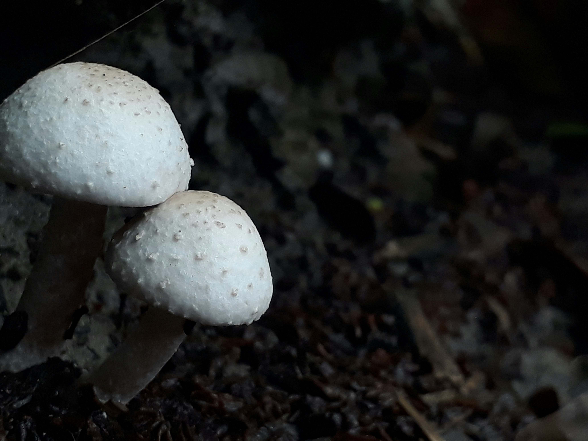

# White Mushroom on Brown Soil

柔和的光影如轻纱般洒落，两朵白色蘑菇静静伫立在棕土之上。白伞宛如未绽放的玉盏，表面纹理细碎如时光镌刻的温柔纹路，在漫射光线中泛着微光，边缘晕开淡雅的光晕，似将自然的灵气凝于伞面。棕土如大地肌肤，暗调中裹挟着岁月呼吸，颗粒与腐叶将沉默的质感铺展成古老的故事书页。

构图上，近景特写将蘑菇形态与土壤质感推至视线中心，深色背景如岁月的幕布，只余两朵白伞与棕土构成空间叙事。光影在此成为温柔的雕塑家，为蘑菇镀上柔和的轮廓光，让白伞与棕土的对比既强烈又和谐，如一首关于自然静默的诗。

这般景象，是森林生态循环的诗意注脚。白蘑菇在腐土中生长，是大自然微生物与菌类共生的奇迹，也是地球生态网上一环如画的跃动。不同地域里，蘑菇承载着独特文化记忆——或是药用智慧传承、或是餐桌风味记忆，亦或是野外探寻者的精神图腾。这片棕土与白伞组合的诗意空间，正是自然馈赠给人类的地理与文化地标，见证了生态与人文在微不足道之处绽放的璀璨光芒。