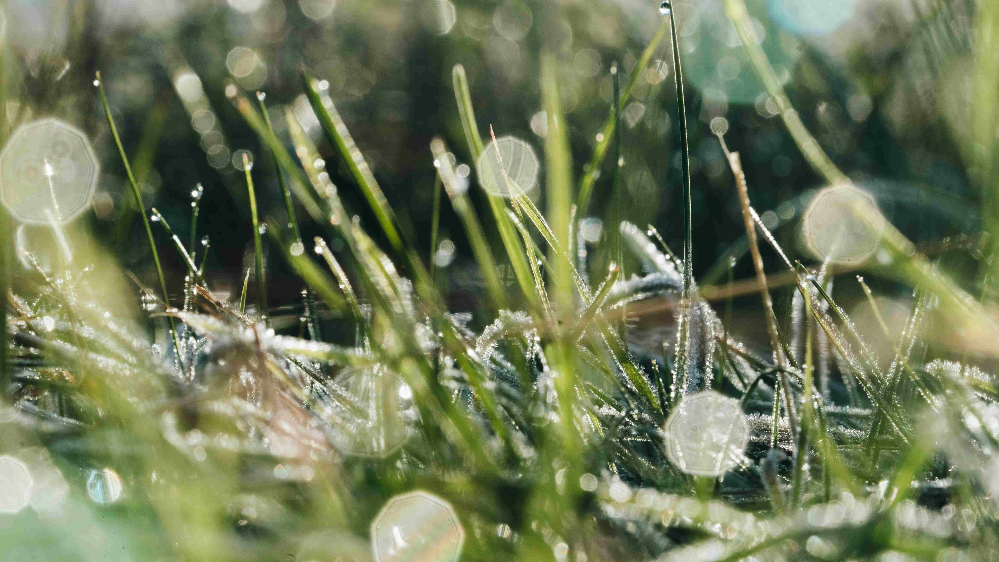

# 草叶上的晨之絮语  
晨光轻吻草垅，每根草茎都缀着凝结的露水。露珠如散落的星子，在晨雾中折射出细碎的光斑，将草叶镀上一层朦胧又透亮的薄纱。光影在草茎间交错穿梭，露水的澄澈与草色的翠绿相互交织，构成一幅鲜活的自然写意画卷。草叶的脉络在露水的浸润下愈发清晰，像被时光温柔勾勒的脉络，而那晶莹的水滴，如微型水晶，将晨光碎成千万颗璀璨的微粒，在光影里闪烁、跳跃，为这片草地增添了灵动的生机。  

这一方草地的晨露，是天地自然诗意的外显。在气候湿润、晨夕温差较为明显的地域，晨露是生态脉络的重要见证——它们是空气水汽在清晨凝结而成的馈赠，维系着草地的生灵与生态循环。从文化维度而言，晨露是人类与自然对话的记忆载体。东方哲学将其喻为“筛过月光”的精灵，认为其蕴含天地灵气；西方诗学常以晨露赞美自然的纯净与脆弱。在这片草地上，晨露不止是光影艺术，更是地域文化里“亲近自然、珍视纯净”理念的具象表达。每一滴露水都承载着地域生态的呼吸，每一缕晨光都映照着人与自然往昔的温柔羁绊，让这方寸草地，在晨光照映下成为地理与文化的鲜活注脚，诉说着自然与人文交织的故事。