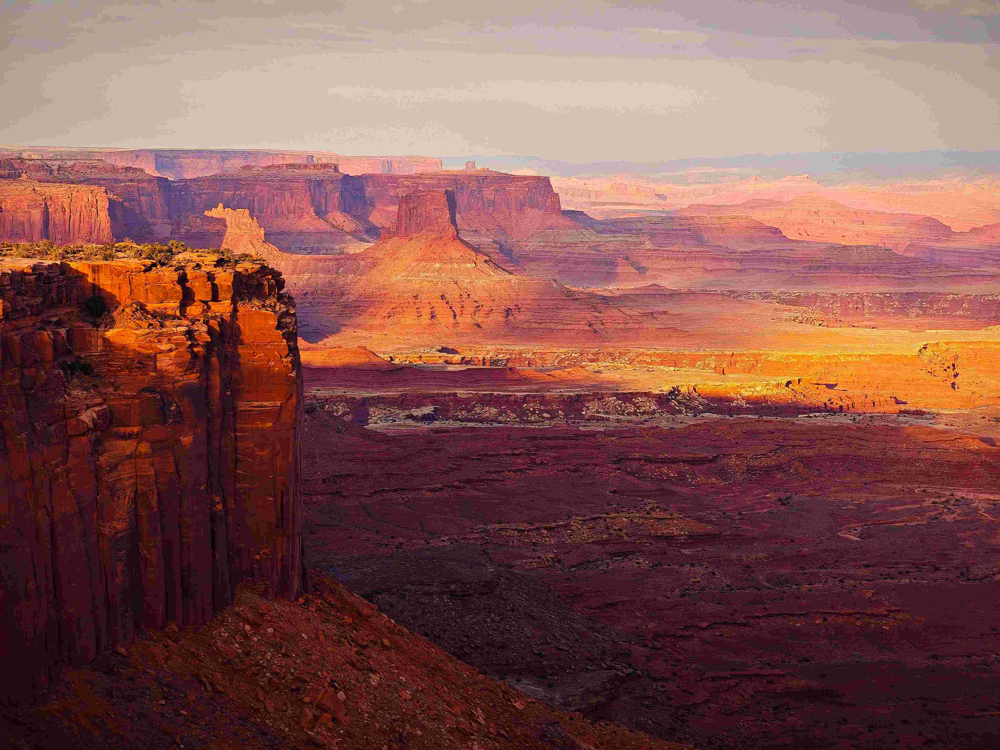

# A scenic view of the grand canyon in the desert

阳光如熔金般轻抚峡谷的肌理，岩壁的色彩便化作流畅的诗行在天地间舒展。画面里，暖橘、赭红与靛蓝等色调在光影的轻拢下层次分明：近处岩崖被夕照晕染成鲜亮的金橘色，纹理的粗粝与光影的柔媚形成奇异对照，如大地伫立的雄伟卫士；远处沟壑与崖壁逐渐褪成朦胧的粉杏与湛蓝，天地在光影的晕染下愈发辽阔宽敞。构图如史诗般排布，高耸的岩崖如雕塑矗立，俯瞰着纵深向天际延伸的峡谷，每一道断层都是自然千万年刻下的年轮，广袤与细腻交织，漾起静穆与蓬勃共存的张力。

这震撼的景致后，藏着地理与文化的厚重叙事。千万年水流侵蚀与风化雕琢出的大峡谷，是地球历史的地平线，砂岩与页岩的纹理，是亿万年沉积留下的注脚，每一次沟壑、岩壁的变迁，都是自然里程碑式的见证。从文化维度而言，这片土地曾是原住民文明滋养的沃土，他们的传说与图腾在此山水间沉淀传承，人与峡谷的联结，是大地传递出“敬畏与智慧”的纽带。当目光掠过峡谷的纵深，恍惚能感受到亿万年水流的回响，看见岁月在岩层上雕琢的痕迹，这仅仅是沙漠中奇谲的山水景观吗？不，这是自然与人文共同书写的生命史诗啊。

这片峡谷在光影里舒展的姿态，是地质变迁的见证，也是文化与心灵的对话。每一道岩纹都是时光留下的指纹，每一寸土地都在诉说着地理轮廓与文化基因的共生关系，当阳光渐渐退去，峡谷陷入静穆的沉思，而其背后承载的故事，于岁月的长河里永恒地回荡。