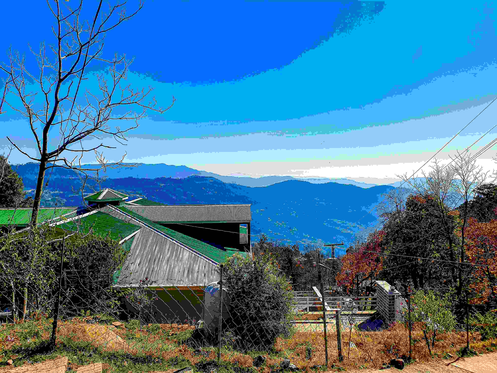

# A View of the Mountains from the Top of a Hill  

站在山岗之巅，目光所及处是层层叠叠的青山在澄澈蓝天下舒展。光影如丝带般轻拂山峦轮廓，阳光泼洒时，远处的山脊泛着柔和光晕，仿若被月华轻洒的绸缎，每一道山峦起伏都像时光刻下的纹路，承载着岁月交融的故事。色彩是苍茫与澄澈的韵律——深浅青蓝晕染山峦，从近处的深蓝渐变到远处的浅青，仿佛自然以色彩铺展空间呼吸感；近处的建筑具有青绿屋脊与银灰钢质檐角，在自然色调中成为和谐的碰撞亮点，树木或疏朗或斑斓，枝桠交错间为画面注入灵动感。构图上，前景的树木与建筑、中景的山峦、远景的薄雾云层，层层错落如天地间一幅灵动的画卷，每一处景观相互呼应，构成最美的自然史诗。  

这般山景背后，是地理与文化的深邃故事。山在诸多文明中是信仰的皈依与生存的依托，此处山与建筑共生，是人与自然千百年模仿与和谐的见证。青山的连绵承载着世代居住者的劳作、祈愿与岁月记忆，建筑静立山间，是文化与自然血脉相连的注脚。当风过树梢、云在山风间游走，这光影、色彩、层次交织的景致，既展现了山河的辽阔与静谧，也传唱着人类与自然共生的文明史诗，每一道光线、每一抹色彩、每一处构图都在诉说这片土地的生命力与精神脉络，让山岗之巅的 view 变为历史与诗意交织的永恒回响。