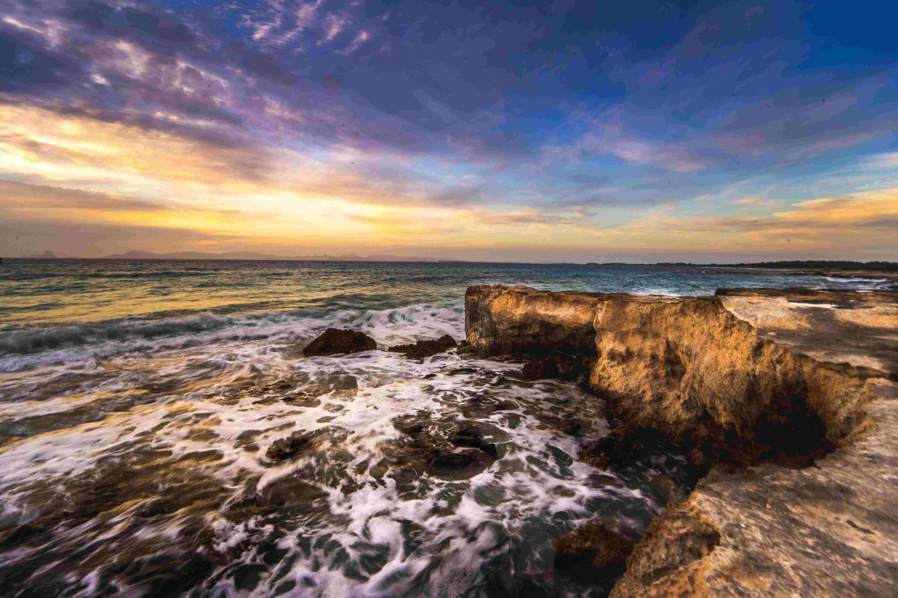

# Ocean Waves Crashing on Rocks During Sunset

当夕阳的暖金与暮蓝在天际织就绚烂的幕布时，海浪正以满心的温柔与力量，拍打着海岸的岩石。金橘色的霞光如熔金般倾洒在海面，每一道浪纹都漾着夕阳的羽衣，波光粼粼间仿佛藏着整个黄昏的温柔心事。岩石如古老的守望者，表面的纹理刻着时光的刻度，在浪涛的轻抚下，白色浪沫如碎玉般迸溅，又很快消融于海水，似岁月里短暂又深入的相拥。天空是色彩的艺术拼图，紫蓝与橙黄交织成梦幻的织锦，纹理与光影在天地交界处轻轻晕染，构成宁静与动荡共存的绝妙构图。

这片海岸，是地理与时间共同雕琢的传奇——海浪千万年的拍击塑造了岩石的独特形态，而人类文明与海洋的关系也在此生生不息。古时渔人依此处浪声为归期，文人墨客借这暮色抒写胸臆，如今身处此地，更感知到是天地共赴一场玄妙之约。夕阳下的海浪与岩石，不仅是自然景观的盛宴，更是时光的故事容器，承载着人类与海洋共生的历史，与自然对话的情感延续。在这里，每道浪花的沸腾与岩石的沉默构成对话，每缕晚照的光芒都晕染着关于坚韧与诗意的地理文化注脚，让人在自然的怀抱中，触摸到跨越时空的共鸣与宁静的力量。