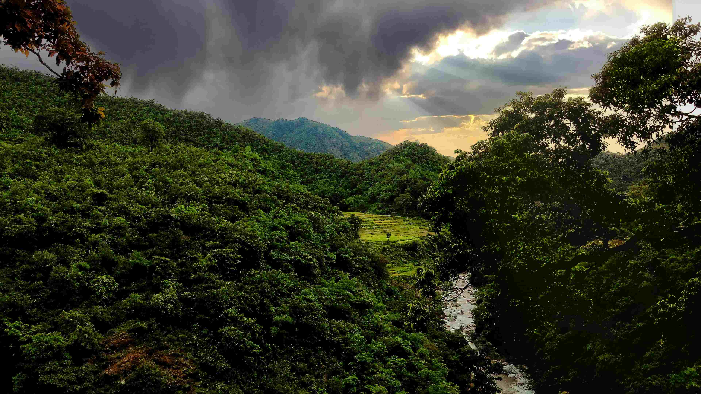

# Sun, Cloud, Hill, Green - Perfect Landscape

阳光穿透层层乌云，将金色的光芒如丝带般洒在起伏的山峦上。山峦被浓密的绿意笼罩，形成一幅深邃又鲜活的织锦，从深郁的翡翠色到轻柔的淡绿，层次丰富的绿意随光影的变化悄然变换，如同大地挥就的生命乐章，每一道光影都为苍翠的山野添上灵动的韵律。乌云如墨色的绸缎铺展于天空，却恰好让阳光穿透缝隙，在山间投下缕缕灵动的光带，为蓬勃的绿色增添了一层诗意与神秘。色彩在天地间碰撞交融，深浅不一的绿交织成自然的乐章，明暗相间的光影编织出生命的韵脚。  

山间溪流似银线般蜿蜒穿行，将自然的蓬勃生命力具象化为流动的水脉。远处隐匿于绿浪中的梯田，是人类与自然共生的注脚——以智慧驯化土地，让山川有了收获的仪式感。从地理维度看，这里山川峡谷蕴含着丰富的水汽与植被，是人类与大地共生共融的场所；从文化层面，它传递着人与自然和谐相处的哲学，每一抹绿意、每一缕风、每一束阳光，都编织进对自然的敬畏与依恋。这里的山、云、绿、光，不止是视觉上的完美构图，更是地理与文化交织的叙事，让自然之美与人文之思在天地间深度融合，绽放出永恒的韵味。