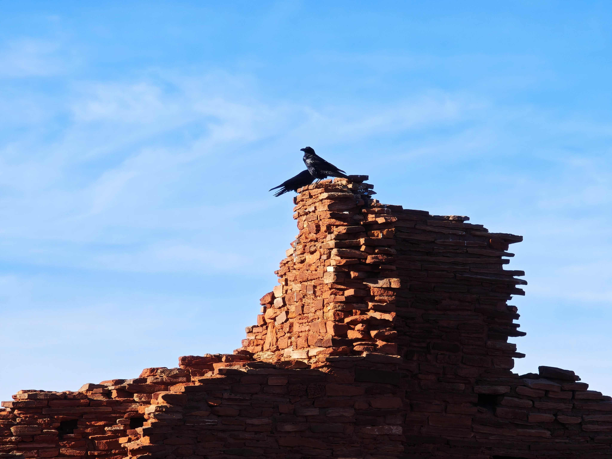

# A Bird Perched Upon the Ruined Red-Brick Structure  

当目光聚焦于那只栖息于古老砖石遗迹之巅的鸟雀，光影便如灵动的笔触，在砖墙与天际间编织出梦幻的层次。砖块的色泽在日光下泛着温润的红棕，每一块砖石的纹理都被岁月雕琢得粗糙却蕴含故事，阳光倾洒时，在砖堆表面晕染出明暗交错的轮廓，历史的沧桑与自然的生机在光影的吻痕中交融。蓝天如澄澈的幕布，将这方古老的废墟托举成历史的雕塑，鸟的黑羽在光与色的交织间，成了一抹凝重的注脚，鲜明对比中更显生命的坚韧。  

砖石构成的遗迹有着粗犷的几何形态，砖块垒砌的痕迹诉说着往昔文明曾在此沉淀的岁月。这处砖墙，或许是某处古老群落留下的遗迹，红砖在风霜中留存，见证着时光的流转与文化脉络的延承。当飞鸟停驻于顶部，它似成为古今对话的使者，让这片砖墙从历史的光阴里，重新有了自然的呼吸。地理与人文的碰撞在此刻达成和谐，砖墙承载的历史故事，与飞鸟带来的自由气息交织，谱写出一片属于土地与时光的诗意乐章。每一块砖石的沧桑与每道光影的温柔，都成为地理文化脉络中，永恒的诗意注脚。