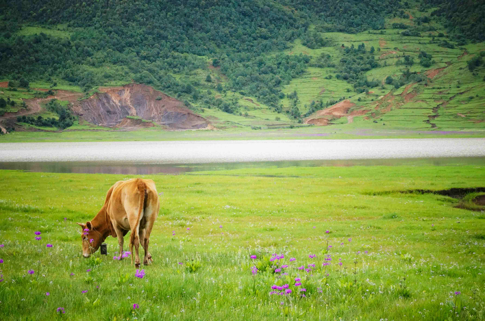

## A Cow Grazes in a Field Near a Lake

在光影轻漫的瞬间，一幅如诗如画的面容缓缓展开。嫩绿的草地如蓬松的绿毯，在温柔天光下漾着柔和微光，其间簇簇紫色小花似星点繁星，为生机盎然的河野缀满灵动色彩。一头棕褐色的牛正低头含情地啃食草意，庞大的身躯与周遭的绿意相融，其姿态承载着时光的沉淀，与这片土地相契相融。近旁，一片澄澈的湖水静静铺展，波光在风里轻漾，映着天空的霞影，让整个场景似蒙上一层淡远的水墨。远处山峦层层叠叠，墨绿与浅草的色带交织，恍若自然以蓬勃绿意与地质纹理书写的史诗，山体间或隐现的棕褐地貌，为翠绿添了张力与层次，构图层次分明，让视线在山水与草地间悠然流转。

这片近湖的草地，是自然与人文共振的舞台——温柔的水湾滋养着青草与野花，静谧的水平原让牛群享受悠然，而远山托载的不仅是山水的壮阔，更承载着当地以自然为根的文化脉络。在这里，放牧的牛群是农耕文明与生态共生的一部分，它们与土地、湖水、山水共同构建了可持续的生存图景。每一寸绿地、每一汪清水，都是岁月里沉淀的文化密码。当牛在草地上自在觅食，当山水在风里低诉历史的深沉，我们看见的，是自然与人类千万年来的和鸣，是地理与文化的深情低语。在光影与色彩交织的诗意里，流淌着这片土地独一无二的精神血脉。这片近湖的草甸，是自然馈赠的诗行，也是文化与土地共生的注脚，每一缕风、每一寸绿、每一滴水，都在诉说这片土地独特的生命故事与历史温度，写就了人类与自然和谐共处的旷世篇章。