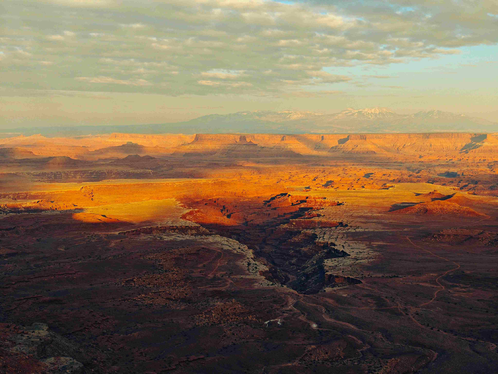

# An aerial view of a desert with a river running through it

当从高空俯瞰这片天地，光影如灵动的诗行，在广袤的沙漠铺展。暖金色的余晖漫过红棕色岩层与峡谷，岩层明暗交错，近景的沟壑在光影中写满岁月密语，暗处似沉郁的峡谷，亮处如迸溅的金芒，每道光影都刻着风沙雕琢的年轮。  

色彩是大地永恒的肌理，赭红与焦褐交织成荒原的厚重张力，远处峰峦的灰白与天际淡青相叠，恍若时间将峰峦晕染成温柔的淡墨。蜿蜒如银丝的河流，在红赭色的块面间划出灵动的曲线，成为荒芜沙漠中跳动的生机之舞，像自然无声的诗行，缝进这片天地。  

从构图维度看，天地悠远辽阔，河流似丝带系在沙漠的胸腔，近景峡谷如层层展开的时光褶皱，远景雪山与云层则是天空轻叠的帷幕。这般布局让辽阔与灵动形成绝妙对照，暗合了自然与文明共生的哲思。  

这般景象背后，是地理与文化的千年对话。河流在大漠荒芜中是生机与希望的象征，千万年塑造地貌，孕育文明；远古部落、旅人依水而居，在岩壁上刻画着生存与信仰的故事；沟壑与峡谷的沉雄，是风与水千万年雕刻的史诗，每道脉络都藏着自然变迁的密码。而当下的光影色彩，又为这片土地赋上时间的美学，使地理景观成为文化记忆的视觉注脚。  

在荒芜与生机交织的天地间，河流如生命的丝带，在沙漠肌理上划下岁月的弧线。当光影倏地转换，色彩悄然晕染，这片天地在沉默中诉说：自然与文化，本就相融共生，于光影与色彩间，诞生永恒的意境与故事。