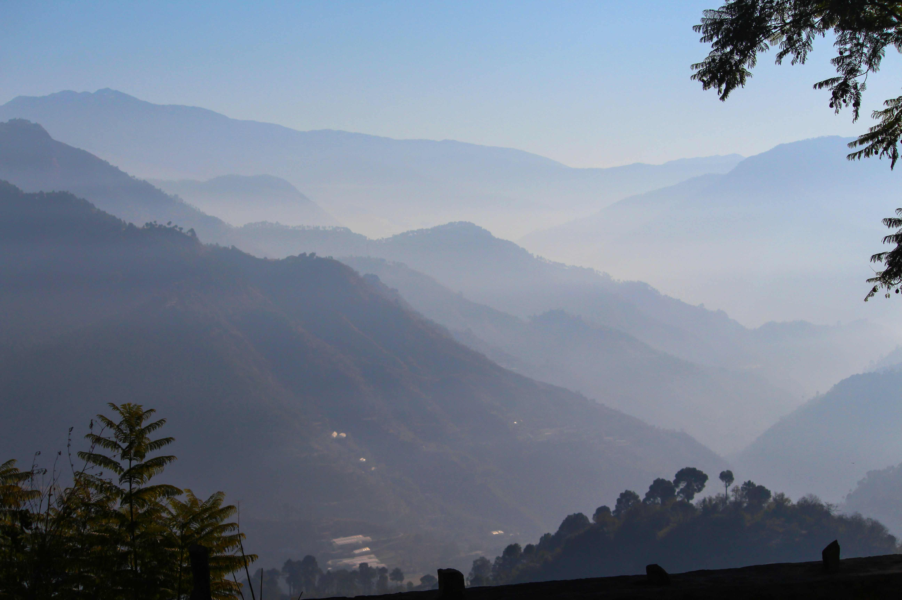

# Green Trees and Mountains in Daylight

当日光如薄纱轻笼山峦，绿树与层岩在白昼的温柔里舒展时，自然将一幅天地长卷缓缓展开。山体在光影中晕开青灰色的层次，近处的树木醉染成蓬勃的绿，叶片间漏下的光线在山坡投下细碎的光斑，如星子散落。远山在薄雾中渐次褪成淡蓝色，轮廓若隐若现，天际线与山脉相拥，构成一曲宁静的山水和声。构图如精心设计的旷野交响曲，每道山脊的起伏、每簇树叶的疏密，皆在光影的勾勒下，成为自然与艺术交织的注脚。  

这般景致，是地理与文化共舞的注解。山地地形赋予这片土地独特的生态与人文基因，绿色的树木不仅是自然的肺叶，更是当地文化中“天人合一”理念的具象表达。山脉的层叠见证了古人类依山而居的智慧，树与山的共生也承载着代代相传的生产生活故事。阳光为山脉镀上暖金，也晕开了历史与生态的脉络——在这里，自然景观是文明的载体，生态智慧是文化的根脉。每一道山影的延伸、每一簇树叶的颤动，都在时光里续写着人与天地相生的千年史诗，让这片绿意与山峦成为自然与文化交融的永恒注解。