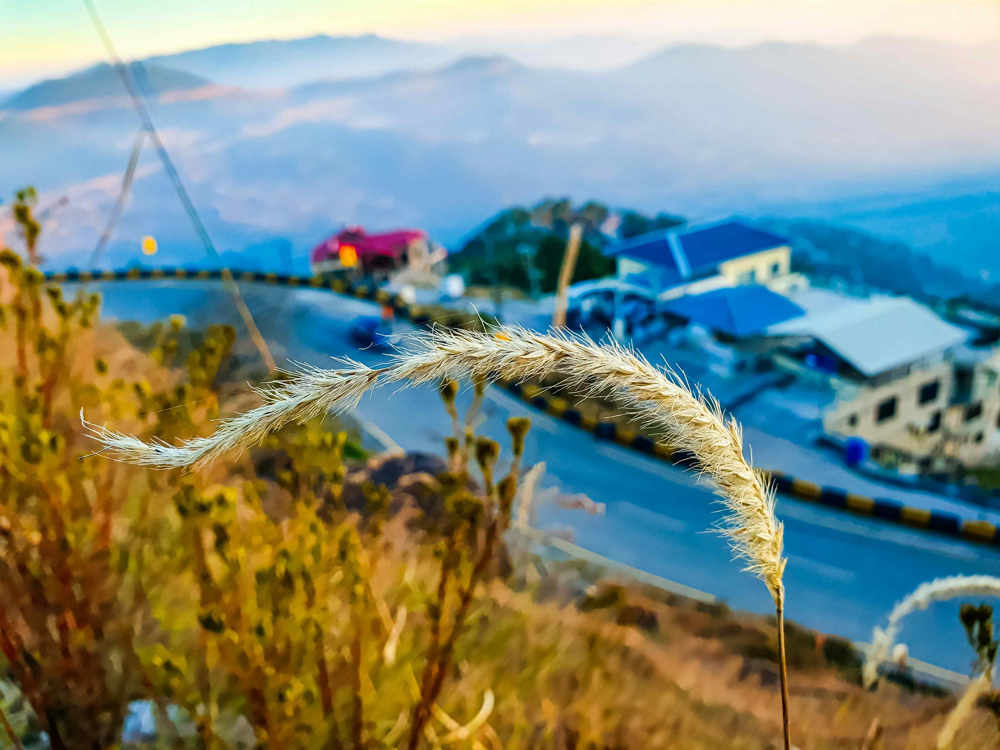

# A Hilltop Gaze Over the Town
站在山巅回望，眼前景象如一首流动的诗。近景处的植物在光影里漾起温柔波纹，草穗似银白丝缕，被熹光裁成细碎光斑，暖金与浅棕的色泽如秋阳轻披，为画面晕开一圈暖融的底色。色彩在空间中层层晕染：前景草色裹着暖黄的秋意，中景城镇蓝顶白墙、红屋错落，像散落的云朵，背景山峦被薄雾托举，幻化出淡紫与青蓝的渐变，层叠的色块似自然与人文交织的诗行。构图如精心编排的风景画，前景植物是天然的画框，轻引视线转向中景城镇，那蜿蜒的公路、错落的建筑，在山风里舒展着生活的烟火气；远山如历史的幕布徐徐铺展，雾霭间藏着古老山水的沉默，山体与城镇的依存，诉说着人类与地形共生的智慧。

这山巅之景，是地理与文化的生动注脚。城镇依山而建，建筑形制呼应着山地脉络，岁月在砖石与屋顶间镌刻故事；前景植物不仅是自然个体的鲜活，更见证着此地四季更迭与生态循环。远山是地理的根脉，见证聚落兴衰；草本与城镇共生，是人与自然在山水间达成的诗意和解。当光影为画面添彩，我们看见的不仅是城镇与山川的呈现，更是此地人文与自然共生的千年脉络——自然以山脉为骨，人文以聚落为肉，而植物则是连接二者的柔软经络，诉说人家与山川共生的悠久故事。