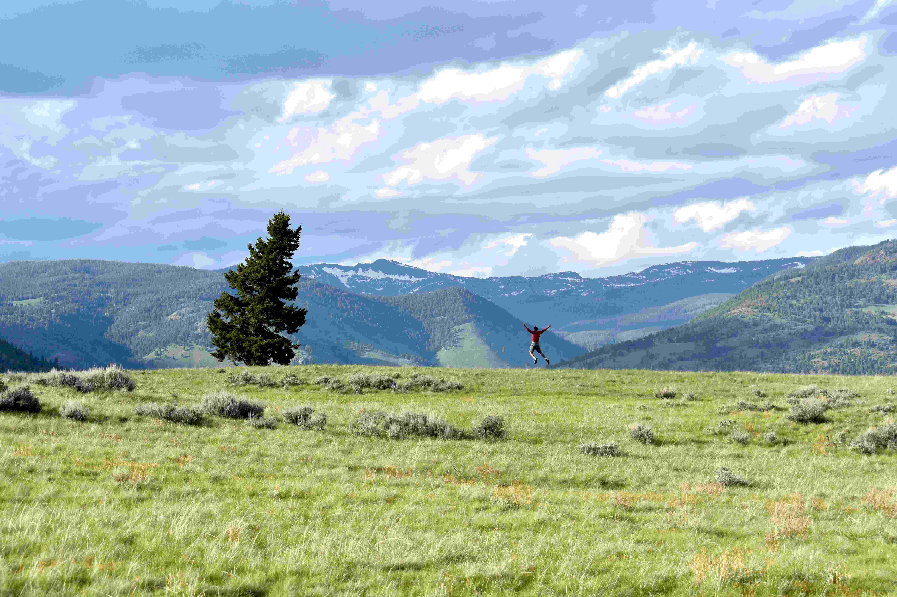

# Into the wild with fresh air

在光影轻柔交织的天地间，这片旷野如被岁月精心晕染的画卷般舒展。翠绿如茵的草地从眼前缓缓延伸至远方，每一寸草叶都在风里漾着生机，似在热烈呼吸自然的馈赠；左侧那棵高大的古树，深墨枝叶如沉默的守护者，在广袤原野间成为一方专属天地。远处山峦层峦叠翠，顶端残留的淡素雪迹与天际云絮相拥，蓝天被云霞晕染成柔和的蓝紫，光影在云层间隙流转，为苍穹织就轻柔的纱幔。  

画面中央，一个身影跃起，双臂舒展如拥抱这辽阔天地，那鲜红上衣在绿野间跃动成一团跳跃的生机，人与旷野在此处完成一场生动的共舞，每一缕空气都似在传递着自然的脉搏与心跳。  

这片野地蕴含着深厚的地理文化脉络：远山、草原的轮廓，是自然以千万年刻绘的大地史诗——这里是传承自然生态与文化精神的核心场域。风掠过草野时，泥土与草木的芬芳随着空气漫过鼻腔，又裹挟着岁月沉淀的呼吸，这是地理馈赠的清新，更是文化里亲近土地、效仿自然的深层精神。人在此空旷与辽远的怀抱中，实则在与土地的历史、与自然的呼吸对话。那扑面的新鲜空气，是天地间流动的诗意，连接着地域的灵性与文化传承中对自然的敬畏与热爱。当云卷云舒，风抚草浪，人与旷野的共生，正诠释着自然法则中彼此依存的深刻联结。旷野的广袤既束缚又自由，既博大又温柔，空气里的气息始终是自然与文化赋予心灵共生的养分。  

当人跃起拥抱天地，是身心与灵魂对自然的同频共振，让心灵与土地的呼吸同脉。而这清新的空气，正是这场旷野之旅的注解——在自然中行走，不仅是身心逃离与回归，更是对地理文化深层的叩问与致敬。这片旷野的风、草地、云影，都谱写着自然与人文共舞的乐章；而那扑面而来的气息，是地理文化赠予生命最温柔的馈赠。