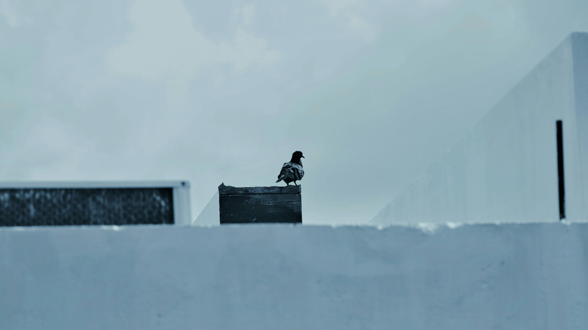

# 雪间孤影，木上沉思  

日光明亮的雪地上，一只鸽子静伫于深色木箱之巅。画面的光影如轻柔薄纱，雪地泛着柔和的蓝灰色，每一道纹路都裹挟着清冷与静谧，仿佛冬日余温尚未消散。深色木箱的粗粝质感，与雪地平滑的质面形成鲜明对比，刚柔交错，构成视觉张力；天空朦胧，似被轻雾轻笼，光线温软，无尖锐的阴影，仅为万物晕上一层温柔光晕，为这寒冷地域添了静穆的慈悲。  

色彩上，整体调性偏冷，蓝灰为主基调，让画面如凝固于深冬的诗行，雪地的纯净、木箱的沉静，搭配鸽子的轮廓，在简洁的背景中更显生动，又因环境的空旷，隐隐透出孤独与自由交织的情绪。  

此景背后，暗藏地理与文化的脉络。此地或为寒冷的北方地域，冬季积雪常覆大地，见证着人与自然、人工造物与野性生命的交融。深色木箱或许是生活的遗迹，亦或是人工器物与冰雪自然共生的见证；而鸽子以栖息的姿态，成为人类文明与大地自然的连接者，是文化无声的注脚——在冰寒与寂静中，生命以微小之姿延续，也见证着天地沧桑与人文脉络的交融。雪的纯净、木的沉静、鸽的灵动，在此刻达成平衡，如一则关于耐心的故事，在风霜轻蹭的光线里，静静诉说土地与生命的温柔契约。