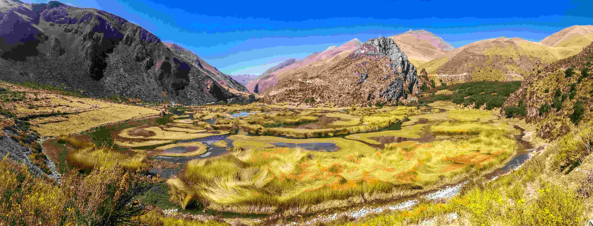

# Full Color

目光初触这张被阳光温柔晕染的画面时，满溢的生机与沉淀的历史感便瞬间勾住心灵。澄澈如宝石的蓝天将金芒倾洒在绵延的山峦，灰褐与赭黄交织的山石在光影中漾开温婉的褶皱，仿佛时光在此刻轻轻停驻，任色彩自由舒展。山谷间，蜿蜒的水道如银带穿梭于金黄与墨绿的草甸间，水面映着天空与远山的色调，漾开层次丰富的柔光；草甸上的绒毛草在风里轻舞，金黄与橙红的纤维在阳光下闪烁，似大地用彩笔绘就的天然花环，每一道曲线都藏着岁月沉默的故事。远处山峦的轮廓在晴空下清晰浮现，粉赭与黄壤的碰撞，让自然谱出一曲关于平衡与生命的乐章，构图如一幅被时光晕染的巨作，色彩与形态都在诉说地理与生命的对话。  

这处景致若矗立在安第斯山脉的谷地之中，水道与草甸曾是古文明滋养农耕的智慧笔触。古人们以顺应自然的哲学驯化土地，山川也悄然沉淀下关于生存与艺术的哲学。每一抹色彩都在诉说历史：阳光是时间的画笔，山脉是文明的脊梁，水与草甸是人类与自然共生的注脚。当光影在此刻凝结为永恒，我们看见的不仅是风景，更是地理与文明的永恒诗行，满溢着的，是自然与人文交织的绚丽色彩，在岁月的长廊里，永存为一曲关于土地与生命的颂歌。