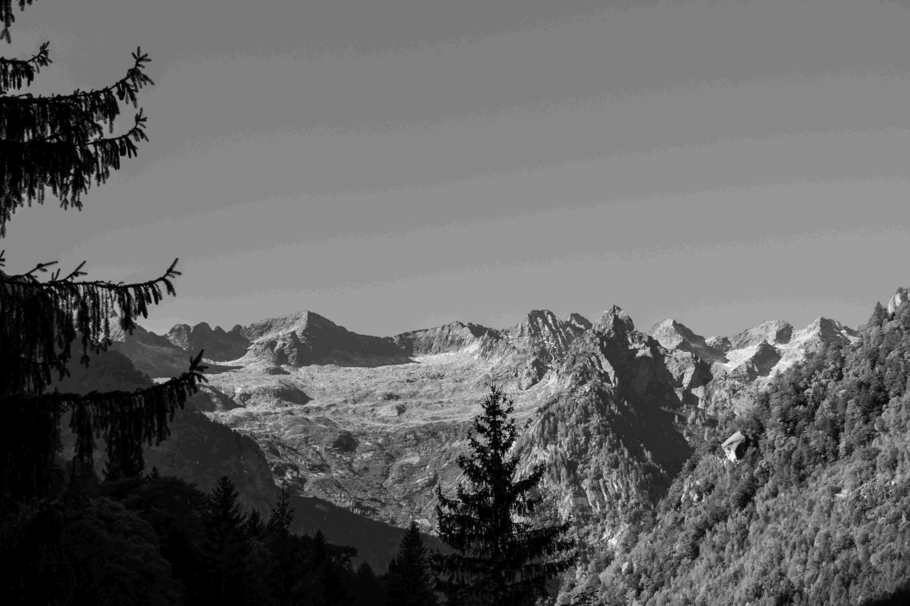

# A Black and White Symphony of Mountain Ranges  

当黑白画面的维度轻轻叩响视觉，那片山脉便成了时光与自然的凝眸之境。光影在山体与松林间流转，明暗交织勾勒出山脉的雄浑轮廓与肌理——陡峭的峰峦似苍劲的雕塑，在灰调里漾开岁月的沉默与壮阔。前景的针叶林以深邃黑影静立，中景的山脉叠嶂延绵，每道褶皱都藏着地壳变迁的密语；远景的山脊在朦胧中舒展，似远古的休止符，将天地间的深邃放大。  

黑白这张“滤色”的封面，褪去色彩的纷扰，凸显出自然的本真诗意。松针的轻垂与山体棱角在构图上形成呼吸感：近景的生机与远景的肃穆，以层次缓缓讲述着山野的故事。而这片山脉，或许关联着人类文明悠久的脉络——它是古代民族生存与迁徙的脉络、通商文化的要道，亦是艺术灵感的源泉与哲学思辨的场域。山脉的巍峨影响周边文明的生存与审美，谷间的足印，成了时光与山脉对话的注脚。在光影的怀抱里，山脉不止是地理的轮廓，更是历史与诗意的双重载体，每道山影都在诉说着天地与人文交织的古老叙事，承载着自然与文明千年的温柔默契。