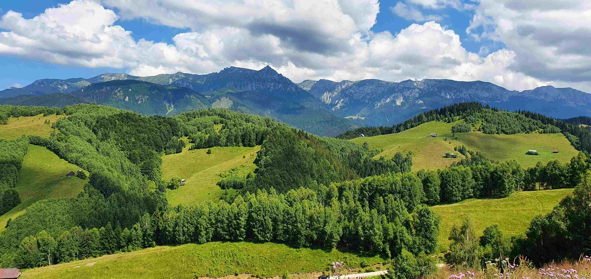

# Green Canopy and Emerald Meadows Under Azure Skies

当目光沉入这片被时光轻拥的景致时，澄澈如宝石的蓝天，将云朵裁成蓬松的棉絮，在天空的画布上肆意舒展。深郁的绿意如浪涛，从森林的枝梢倾泻而下，浸润每一寸起伏的草场，树的阴影与阳光的斑驳光斑交织，为大地铺就一幅光影的织锦。草场的绿像初绽的春之血色，鲜活且纯粹，而那些散落在绿地间的木屋，宛如暗藏的温柔秘语，叩问着人与自然共生几许。

构图上，远山如沉默的史诗，以厚重的轮廓托举着天空；中景的森林与草甸以层叠的绿意温柔过渡，从浓到稀，婉若大地赠予的自然韵律；近景的云朵随光影浮动，让每一处景物都漾着生命的温度。这般景致，不止是视觉的盛宴，更是一座地理文化的立体诗篇——这些山地森林与草甸，承载着岁月深处的人文记忆，森林是水源的守护者，草场是生计的基础，而错落的居所，是多少世代人与天地对话的注脚。在这样明亮的白天，阳光、绿意与蓝天共同编织出一曲自然的协奏，每一片树叶的摇曳、每一缕风的私语，都在诉说着这里地理与文化交融的厚重。