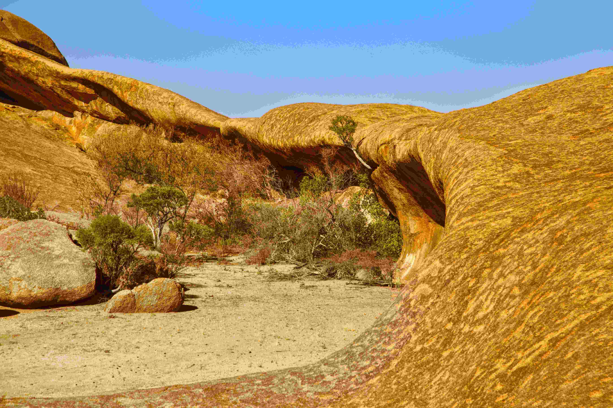

# Erongo mountains

阳光轻吻Erongo山脉的岩体，金褐色的巨岩在晴空下铺展成自然的史诗长卷。光影如灵动的脉络，在岩石表面晕染出岁月的纹路——暖金与深褐交织的肌理，每一道皴痕都藏着地质变迁的密语。岩石的纹理细腻如丝毯，却又是千万年风沙雕琢的粗犷轮廓，色彩从金黄到灰紫，层层递进，成为大地自身演绎的艺术。  

画面的构图充满野性张力：巨大的岩体如天造地设的峡谷与拱门，孤石与低矮植被在岩隙间形成微妙的生态对话，沙石的平面与岩石的曲面构成视觉的层次与节奏。蓝天澄澈如镜，让岩体的色彩与形态更显磅礴，光影在此间穿梭，勾勒出自然的雄浑与静谧。这些岩体是风蚀地貌的杰作，千万年风沙与雨水共同塑造了这壮丽的自然景观，是大地见证地质历史的风砂岩碑。  

Erongo山脉的岩石，不止是地质变迁的载体，更承载着深沉的地理文化叙事。这片土地见证了自然与人类文明的共生：当地原住民文化与这片岩体相伴，传说与历史在此沉淀，地质变迁与人文脉络交织成一部永恒的史诗。岩石的形态似千万年前文明的图腾，成为自然记忆与人文记忆的纽带。当目光触摸岩石的肌理，仿佛听见大地从远古到现代的呼吸；当脚步亲近沙石土地，仿佛感知岁月沉淀的温热。这里的风蚀岩体，是自然与文化的交融，诉说着时间、地貌与文明的深度故事，成为地理与人文共生的鲜活注脚。